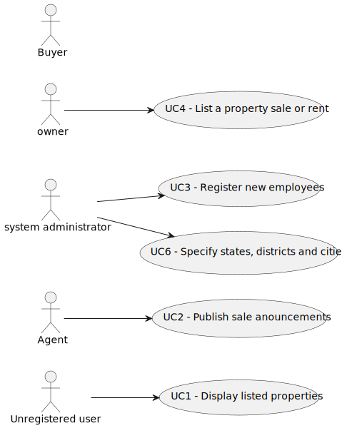

# Use Case Diagram (UCD)

**In the scope of this project, there is a direct relationship of _1 to 1_ between Use Cases (UC) and User Stories (US).**

However, be aware, this is a pedagogical simplification. On further projects and curricular units might also exist _1 to
N **and/or** N to 1 relationship between US and UC.

# Use Cases / User Stories

| UC/US  | Description                                                                |                   
|:-------|:---------------------------------------------------------------------------|
| US 001 | [Display listed properties](../../us001/Readme.md)                         |
| US 002 | [Publish sale anouncements](../../us002/Readme.md)                         |
| US 003 | [Register new employees](../../us003/Readme.md)                            |
| US 004 | [List a property sale or rent](../../us004/Readme.md)                      |
| US 006 | [Specify states, districts and cities](../../us006/Readme.md)              |

