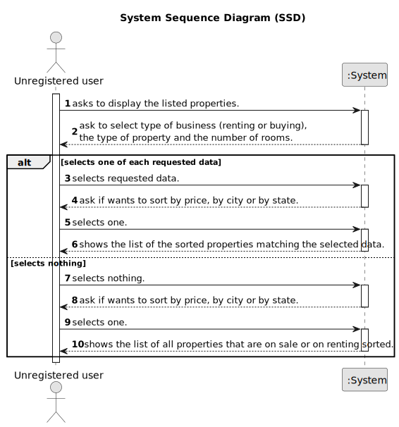

# US 001 - To display listed properties 

## 1. Requirements Engineering

### 1.1. User Story Description

As an unregistered user, I want to display listed properties.

### 1.2. Customer Specifications and Clarifications 

**From the specifications document:**

>	Each property is characterized by having the type of property (apartment, house or land), the area in m2, the location, the distance from the city centre, the requested price and one or more photographs.

>	If the property is an apartment or a house, it also must be provided the number of bedrooms, the number of bathrooms, the number of parking spaces aand the available equipment.

>	In case the property is a house, the existance of basement, an inhabitable loft and the sun exposure must be registered as well.

**From the client clarifications:**

> **Question:** In the project description it is stated that "the client is, then, responsible for being able to consult the properties by type, number of rooms, and sort by criteria such as price or the parish where the property is located.". Is the client able to sort properties by only these 4 criteria or is he able to sort properties by any of the properties' characteristics?
>  
> **Answer:** The client should be able to select the type of business (renting or buying), the type of property and the number of rooms. Then, the client should be able to sort properties by price or by parish where the property is located.
If the client does not select the type of business, the type of property and the number of rooms, the application should allow the client to sort all properties that are on sale or on renting.

> **Question:** Monetary data is expressed in any particular currency?
>  
> **Answer:** Monetary data (e.g. estimated cost of a task) is indicated in POTs (virtual currency internal to the platform).

### 1.3. Acceptance Criteria

* **AC1:** The client should be able to select the type of business, the type of property and the number of rooms.
* **AC2:** The application should allow the client to sort all properties that are on sale or on renting by price or by parish where the property is located.

### 1.4. Found out Dependencies

n/a

### 1.5 Input and Output Data

**Input Data:**

* Typed data:
	
	
* Selected data:
	* a type of business
	* a type of property
	* a number of rooms
    * Sort by price or by parish where the property is located.

**Output Data:**

* List properties that correspond to the choices made
* (In)Success of the operation

### 1.6. System Sequence Diagram (SSD)

### 1.7 Other Relevant Remarks

* n/a