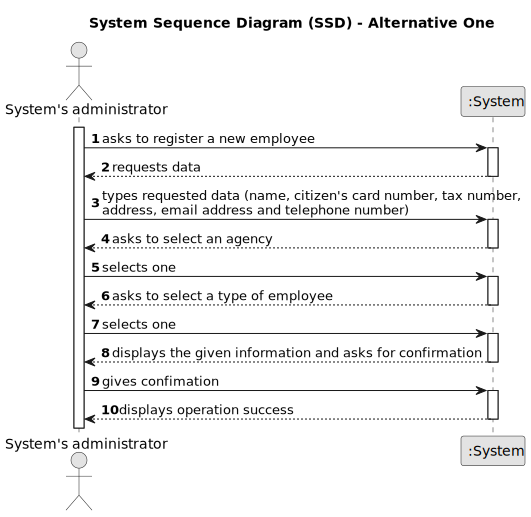

# US 003 -  To register a new employee.

## 1. Requirements Engineering

### 1.1. User Story Description

As a system administrator, I want to register a new employee.

### 1.2. Customer Specifications and Clarifications 

**From the specifications document:**

>	The company's systems administrator will be responsible for registering all employees

>	When registering a new client the system's administrator will have to specify the name, the citizen's card number, the tax number, the address, the email address, the contact
telephone number and the agency to which it is assigned

>	The system's administrator will also be responsible for registering new branches of the network (specifying
the designation, the location, the email address and the contact telephone number)

**From the client clarifications:**

> **Question:** Does the System Administrator have permission to create, edit, delete, or just create new employee registrations?
>  
> **Answer:** For now, the System Administrator can only do what is specified in the Project Requirements.

> **Question:** When registering a new employee, will the administrator set the respective employee password?
>  
> **Answer:** The password should have eight characters in length and should be generated automatically. The password is sent to the employee by e-mail.

> **Question:**  I have a question related to the output data: when the system administrator is registering a new employee are we free to display what we feel is important or should a specific message be shown? I was thinking of displaying whether the operation was successful or not, is that fine or should something else be displayed as well?
>
> **Answer:** A good pratice is to show the information and ask for confirmation.

### 1.3. Acceptance Criteria

* **AC1:** All required data must be provided.
* **AC2:** When creating a employee with an already existing reference, the system must reject such operation and the user must have the change to modify the typed reference.

### 1.4. Found out Dependencies

* N/A.

### 1.5 Input and Output Data

**Input Data:**

* Typed data:
	* the name, 
	* the citizen's card number, 
	* the tax number,
	* the address,
	* the email address,
	* the contact telephone number
	
* Selected data:
	*  the agency to which it is assigned 

**Output Data:**

* (In)Success of the operation

### 1.6. System Sequence Diagram (SSD)

**Other alternatives might exist.**

#### Alternative One

### 1.7 Other Relevant Remarks

N/A.

