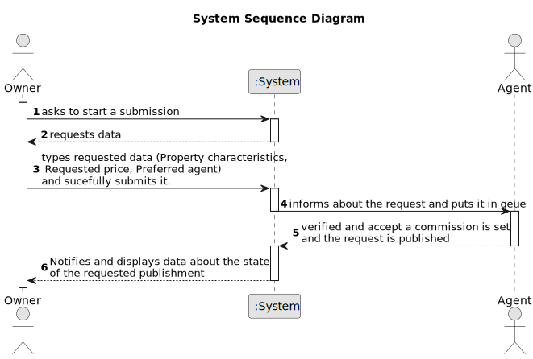

# US 004 - Submit a request to list a property

## 1. Requirements Engineering

### 1.1. User Story Description

As an owner, I intend to submit a request for listing a property sale or rent,
choosing the responsible agent.

### 1.2. Customer Specifications and Clarifications 

**From the specifications document:**

>	When submiting a request the owner can sell/rent multiple properties to an agent of preference

>   Sending a resquest with all the requesites necessary (property characteristics and price),the agent after checking and accepting can now set the commission and publish the order in the system

> The commission can be a fixed amount or a percentage

**From the client clarifications:**

> **Question:** When publishing a property, if the owner leaves the listing unfinished, can it be saved or stay as as a sketch to be finished later ?
>  
> **Answer:** no

> **Question:** Does an owner need to be registered in the system to submit a request for a property listing?
>  
> **Answer:** No. When making the request to list a property, the owner should introduce his own data. The Owner attributes are: the name, the citizen's card number, the tax number, the address, the email address and the telephone number.

> **Question:** When assigning an agent to a property listing, are the available agents shown by the system for the owner to pick? Or does the owner need to provide the agent's information (name, agency,etc)?
>
> **Answer** The owner should select one agent from a list of agents that work in the selected agency. The owner should select the agency before selecting the agent.

### 1.3. Acceptance Criteria

* **AC1:** The User must fill all the obligatory fields in order to submit the request.

### 1.4. Found out Dependencies

**US 006** - Location will be defined by states, districts and cities that were previously defined by the system administrator

### 1.5 Input and Output Data

**Input Data:**

**Selected Data**
* Property
* Agent

**Output Data:**

* Request sucefully submited.
* Offer publicashion state.

### 1.6. System Sequence Diagram (SSD)

**Other alternatives might exist.**

### 1.7 Other Relevant Remarks

* The request stays in a "not published" state in order to distinguish from "published" request.