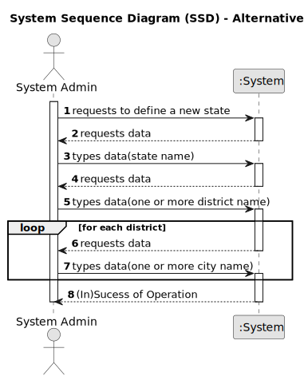
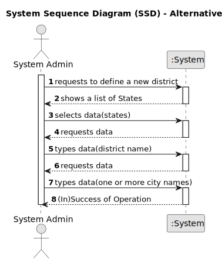
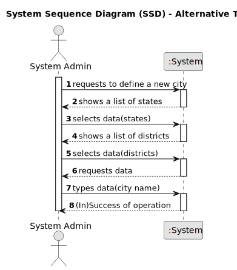

# US 006 - Specifying Locations

## 1. Requirements Engineering

### 1.1 User Story Description

As a system administrator, I want to specify states, districts and cities in the
system.
### 1.2 Customer Specifications  and Clarifications

**From the especifications document:**

n/a

**From client clarifications:**

> **Question:** In user story 006, it says "As a system administrator, I want to specify districts, municipalities, and parishes in the system." What is the purpose of this function, how does the system administrator intend to use the ability to specify different locations?
> 
> **Answer:** The goal is to specify in the system information that can be used/selected to fill the location of the property. An example of the store location is: 71 ST. NICHOLAS DRIVE, NORTH POLE, FAIRBANKS NORTH STAR, AK, 99705.
> For instance, if the information about the existing US states is specified in the system, then the user only selects AK and does not need to write this information.

> **Clarification:** This message is to clarify the format of the address "71 ST. NICHOLAS DRIVE, NORTH POLE, FAIRBANKS NORTH STAR, AK, 99705". In this address we have the:
> * Street: 71 ST. NICHOLAS DRIVE;
> * City: NORTH POLE;
> * District: Fairbanks North Star (this is opcional);
> * State: AK;
> * Zipcode: 99705.

### 1.3 Accpetance Criteria

* **AC1:** Each loaction name must be in alphanumeric characters,
* **AC2:** Each state must have at least one district,
* **AC3:** Each district must have at least one city.

### 1.4 Found out Dependencies

n/a

### 1.5 Input and Output Data

**Input Data:**

* Typed data:
    * state name,
    * district name,
    * city name.

* Selected data:
    * existing state,
    * existing district.

**Output Data:**

* List of existing states,
* List of existing districts,
* (In)Success of the operation.

### 1.6 System Sequence Diagram (SSD)

**Other alternatives might exist.**

**Alternative One**

**Alternative Two**

**Alternative Three**

### 1.7 Other Relevant Remarks

* The location that each property will have all three types(state, district and city) and also a short text(string) with the street, house number and postal code