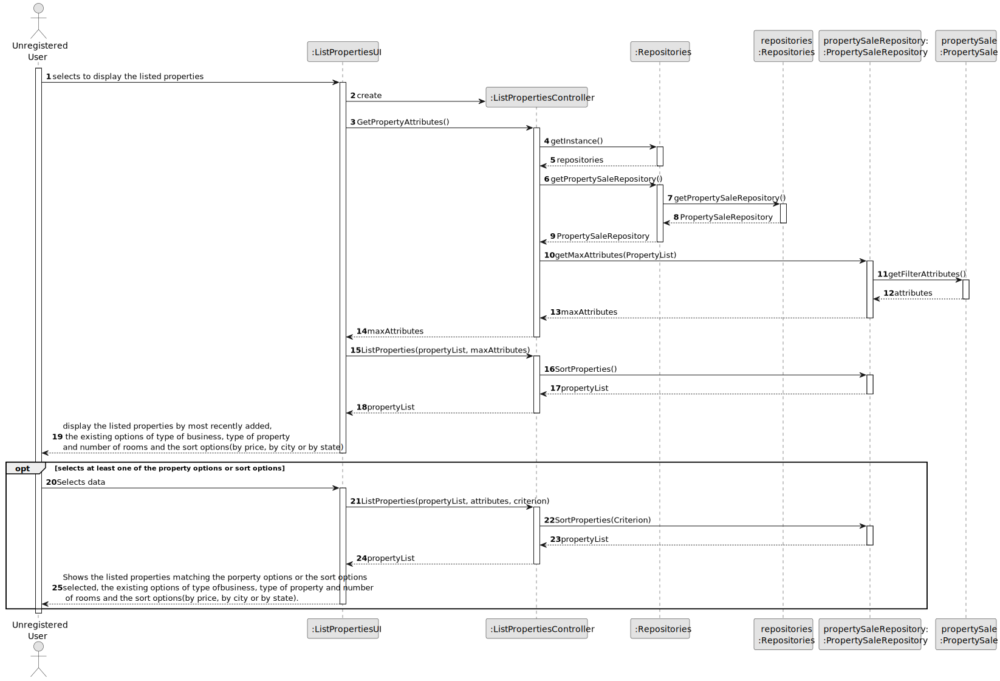
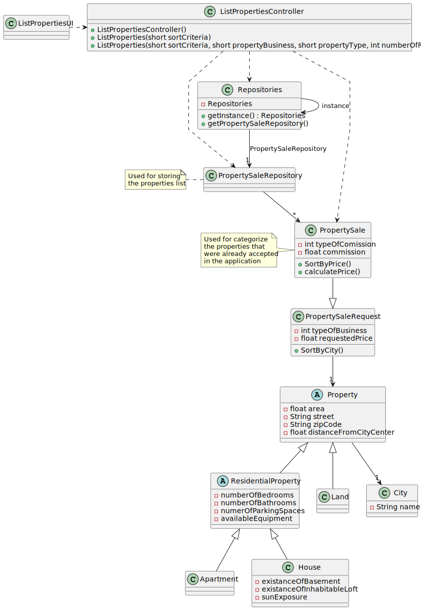

# US 001 - To display listed properties

## 3. Design - User Story Realization

### 3.1. Rationale

**SSD**

| Interaction ID | Question: Which class is responsible for...          | Answer                   | Justification (with patterns)                                                                                 |
|:---------------|:-----------------------------------------------------|:-------------------------|:--------------------------------------------------------------------------------------------------------------|
| Step 1  		     | 	... interacting with the actor?                     | ListPropertiesUI         | Pure Fabrication: there is no reason to assign this responsibility to any existing class in the Domain Model. |
| 		  		         | 	... coordinating the US?                            | ListPropertiesController | Controller                                                                                                    |
| Step 2  		     | 	... knowing all listed properties to display?						 | PropertySaleRepository   | IE: Knows all listed properties.                                                                              |
|                | ... knowing the properties                           | PropertySale             | IE: Has property.                                                                                             |
|                | ... knowing the filter options to display?           | Property                 | IE: Knows its own attributes.                                                                                 |
|                | ... know the sort options?                           | PropertySale             | IE: Has property.                                                                                             |
| Step 3  		     | 	                                                    |                          |                                                                                                               |
| Step 4  		     | 	... displaying the properties?                      | ListPropertiesUI         | Pure Fabrication: The UI is responsible for interacting with the user.                                        |
### Systematization ##

According to the taken rationale, the conceptual classes promoted to software classes are:

Other software classes (i.e. Pure Fabrication) identified:

* Property
* PropertySale
* ListPropertiesUI
* ListPropertiesController
* PropertySaleRepository

## 3.2. Sequence Diagram (SD)

### Full Diagram

This diagram shows the full sequence of interactions between the classes involved in the realization of this user story.

## 3.3. Class Diagram (CD)

