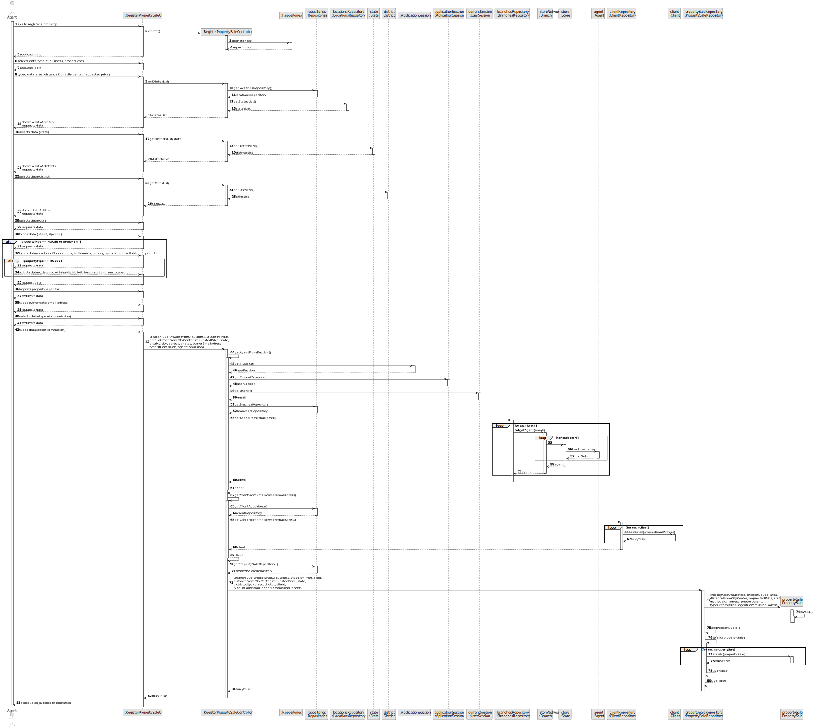
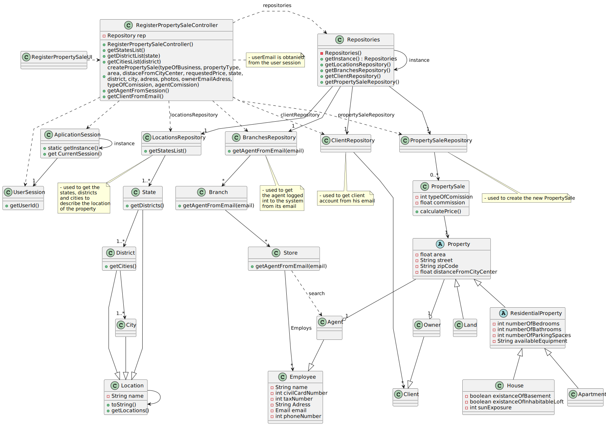

# US 006 - To create a Task

## 3. Design - User Story Realization

### 3.1. Rationale

**SSD - Alternative 1 is adopted.**

| Interaction ID | Question: Which class is responsible for...  | Answer                     | Justification (with patterns)                                                                                 |
|:---------------|:---------------------------------------------|:---------------------------|:--------------------------------------------------------------------------------------------------------------|
| Step 1         |                                              |                            |                                                                                                               |
| Step 2         | ... interacting with the actor?              | RegisterPropertyUI         | Pure Fabrication: there is no reason to assign this responsibility to any existing class in the Domain Model. |
|                | ... coordinating the US?                     | RegisterPropertyController | Controller                                                                                                    |
|                | ... instantiating a new Property?            | PropertySaleRepository     | Pure fabrication: no containers yet. Creator (Rule 1)                                                         |
|                | ... knowing the user using the system?       | UserSession                | IE: cf. A&A component documentation.                                                                          |
|                |                                              | BranchesRepository         | IE: has its own branches.                                                                                     |
|                |                                              | Branch                     | IE: has its own stores.                                                                                       |
|                |                                              | Store                      | IE: knows/has its own Employees                                                                               |
|                |                                              | Agent                      | IE: knows its own data (e.g. email)                                                                           |
| Step 3         | ...                                          |                            |                                                                                                               |
| Step 4         |                                              |                            |                                                                                                               |
| Step 5         | ... knowing States, Districts and Cities?    | LocationsRepository        | IE: has its own States.                                                                                       |
|                |                                              | State                      | IE: has its own Districts.                                                                                    |
|                |                                              | District                   | IE: has its own Cities.                                                                                       |
|                |                                              | City                       | IE: knows its own data.                                                                                       |
| Step 7         | ...saving the inputted data?                 | PropertySale               | IE: object created in step 1 has its own data.                                                                |
|                |                                              | Property                   | IE: object created in step 1 has its own data                                                                 |
|                |                                              | Land                       | IE: object created in step 1 has its own data                                                                 |
|                |                                              | ResidentialProperty        | IE: object created in step 1 has its own data                                                                 |
|                |                                              | Apartment                  | IE: object created in step 1 has its own data                                                                 |
|                |                                              | House                      | IE: object created in step 1 has its own data                                                                 |
| Step 8         |                                              |                            | IE: Task Categories are defined by the Administrators.                                                        |
| Step 9         |                                              |                            | IE: object created in step 1 is classified in one Category.                                                   |
| Step 10        |                                              |                            |                                                                                                               |              
| Step 11        | ... validating all data (local validation)?  | Task                       | IE: owns its data.                                                                                            | 
| Step 12        |                                              |                            |                                                                                                               |
| Step 13        |                                              |                            |                                                                                                               |
| Step 14        |                                              |                            |                                                                                                               |
| Step 15        |                                              |                            |                                                                                                               |
| Step 16        | ... knowing the Client/Owner?                | ClientRepository           | IE: owns                                                                                                      |
| Step 18        |                                              |                            |                                                                                                               |
| Step 19        |                                              |                            |                                                                                                               |
|                | ... validating all data (local validation)?  | PropertySale               | IE: knows its own data.                                                                                       |
|                |                                              | Property                   | IE: knows its own data.                                                                                       |
|                | ... validating all data (global validation)? | PropertySaleRepository     | IE: knows all its tasks.                                                                                      | 
|                | ... saving the created task?                 | PropertySaleRepository     | IE: owns all its tasks.                                                                                       | 
| Step 20        | ... informing operation success?             | RegisterPropertyUI         | IE: is responsible for user interactions.                                                                     | 

### Systematization ##

According to the taken rationale, the conceptual classes promoted to software classes are:

* Agent
* Owner
* Property
* ResidentialProperty
* Land
* Apartment
* House
* State
* District
* City

Other software classes (i.e. Pure Fabrication) identified:

* RegisterPropertyUI
* RegisterPropertyController
* PropertySaleRepository
* UserSession
* BranchesRepository
* Branch
* Store
* LocationsRepository
* PropertySale
* ClientRepository

## 3.2. Sequence Diagram (SD)

### Alternative 1 - Full Diagram

This diagram shows the full sequence of interactions between the classes involved in the realization of this user story.

## 3.3. Class Diagram (CD)

