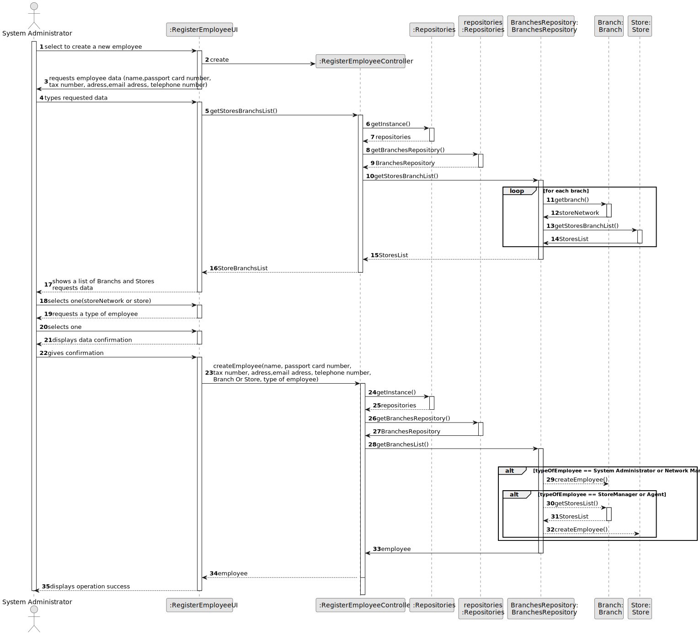
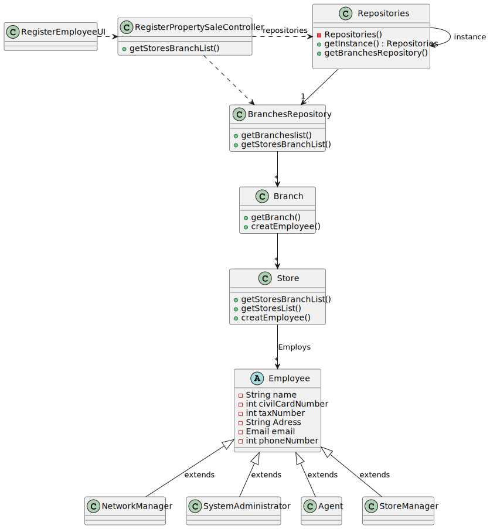

# US 003 - To register a new employee.

## 3. Design - User Story Realization 

### 3.1. Rationale

**SSD - Alternative 1 is adopted.**

| Interaction ID | Question: Which class is responsible for...                                                    | Answer                     | Justification (with patterns)                                                                                 |
|:---------------|:-----------------------------------------------------------------------------------------------|:---------------------------|:--------------------------------------------------------------------------------------------------------------|
| Step 1  		     | 	... interacting with the actor?                                                               | RegisterEmployeeUI         | Pure Fabrication: there is no reason to assign this responsibility to any existing class in the Domain Model. |
| 			  		        | 	... coordinating the US?                                                                      | RegisterEmployeeController | Controller                                                                                                    |
| 			  		        | 	... adding a new Employee?                                                                    | ListOfEmployees            | Creator (Rule 1): in the DM Organization has a Task.                                                          |
| 			  		        | 							                                                                                        | ListOfEmployees            | IE: knows/has its own Employees                                                                               |
| 			  		        | 							                                                                                        | Employee                   | IE: knows its own data (e.g. email)                                                                           |
| Step 2  		     | 	...knowing the data needed to register an employee?						                                     | System                     | IE: Employee's needed data are defined by the Administrators.                                                 |
| Step 3  		     | 	...saving the inputted data?                                                                  | Employee                   | IE: object created in step 1 has its own data.                                                                |
| Step 4  		     | 	 ...knowing the branches and stores?                                                          | Branch                     | IE: knows all its branches                                                                                    |
|                |                                                                                                | Store                      | IE: knows all its stores                                                                                      |
| Step 5  		     | 	                                                                                              | Employee                   |                                                                                                               |
| Step 6  		     | 					                                                                                          |          |                                                                      |              
| Step 7         | ... validating all data (local validation)?                                                    | Employee                   | IE: owns its data.                                                                                            |
|                | ... validating all data (global validation)?                                                   | Branch or Store            | IE: knows all its employees.                                                                                  |
|                | ... saving the registered employee? (if employee is a System Administrator or Network Manager) | Branch                     | IE: owns all employess of the type:System Administrator or Network Manager                                    |
|                | ... saving the registered employee? (if employee is a StoreManager or Agent)                   | Store                      | IE: owns all employess of the type:StoreManager or Agent                                                      |
| Step 8         | ... informing operation success?                                                               | RegisterEmployeeUI         | IE: is responsible for user interactions                                                                      |

### Systematization ##

According to the taken rationale, the conceptual classes promoted to software classes are: 

 * Branch
 * Store
 * Employee

Other software classes (i.e. Pure Fabrication) identified: 

 * RegisterEmployeeUI  
 * RegisterEmployeeController

## 3.2. Sequence Diagram (SD)

### Alternative 1 - Full Diagram

This diagram shows the full sequence of interactions between the classes involved in the realization of this user story.

## 3.3. Class Diagram (CD)

