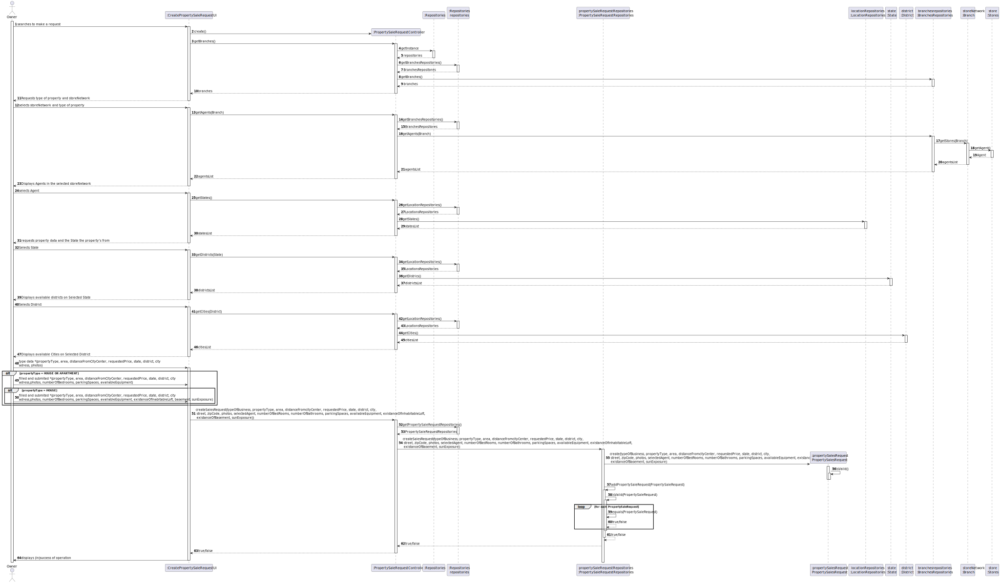
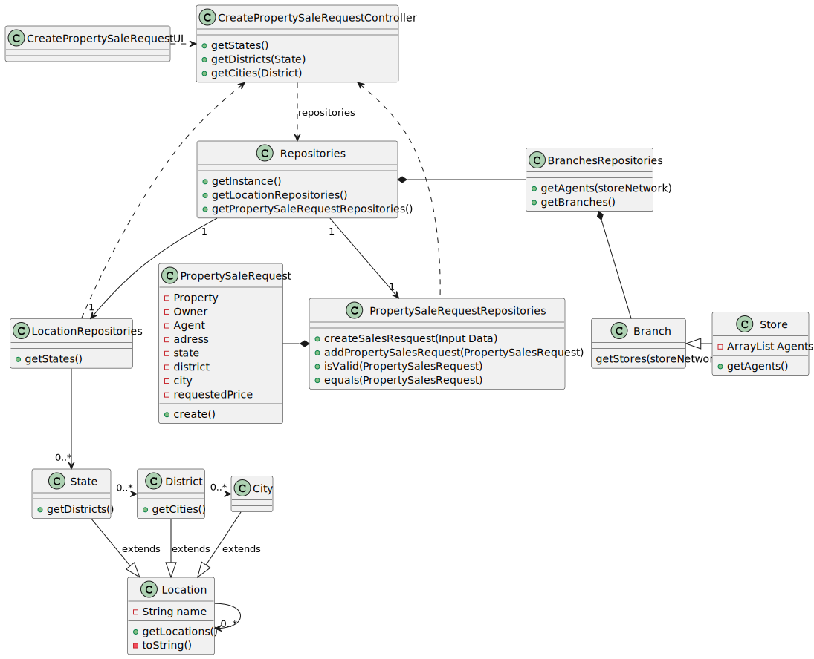

# US 004 - Submit a request to list a property 

## 3. Design 

### 3.1. Rationale

**SSD - Alternative 1 is adopted.**

| Interaction ID | Question: Which class is responsible for...                    | Answer                              | Justification (with patterns)       |
|:---------------|:---------------------------------------------------------------|:------------------------------------|:------------------------------------|
| Step 1  		     | 	... interacting with the actor?                               | CreateRequestUI                     | Pure Fabrication:                   |
|                | ...coordinating the US?                                        | CreatePropertySaleRequestController | Controller                           |
| Step 2         | ...knowing the types of properties to request?                 | CreateRequestUI                     | Pure Fabrication                    |
|                | ...knowing the available branches to select?                   | BranchesRepository                  | IE: knows own data                  |
| Step 3         |                                                                |                                     |                                     |
| Step 4         | ...know the available agents on selected storeNetwork                | BranchesRepository                  | IE: knows own data                  |
| Step 5         |                                                                |                                     |                                     |                                                                                                               |
| Step 6         | ...know the available states?                                  | LocationRepositories                | IE: knows own data                  |
| Step 7         |                                                                |                                     | IE: know own data                   | 
| Step 8         | ...know available districts on selected state?                 | States                              | IE : knows own data                 |
| Step 9         |                                                                |                                     |                                     |
| Step 10        | ...know available cities on selected district?                 | Cities                              | IE : knows owm data                 |
| Step 11        |                                                                |                                     |                                     |
| Step 12        | ...know the attributes to request?                             | CreateRequestUI                     | Pure Fabrication                    |
| Step 13        |                                                                |                                     |                                     |
| Step 14        | ...instantiating new PropertySalesRequest                      | PropertySaleRequestRepositories     | Creator                             |
|                | ...validating inputted attributes(local validation)?           | PropertySaleRequest                 | IE : Object created knows own data  |
|                | ...validating created PropertySalesRequest(global validation)? | PropertySaleRequestRepositories     | IE : Owns all PropertySaleRequest   |
|                | ...saving the input data?                                      | PropertySaleRequestRepositories     | IE  : Object created knows own data |
|                | ...saving new PropertySalesRequest?                            | PropertySaleRequestRepositories     | IE: Owns all PropertySaleRequest    |
|                | ...informing operation success?                                | CreateRequestUI                     | Pure Fabrication                    |

### Systematization ##

According to the taken rationale, the conceptual classes promoted to software classes are: 

 * Stores

Other software classes (i.e. Pure Fabrication) identified: 

 * CreatePropertySaleRequestUI
 * PropertySaleRequestController
 * PropertySaleRequestRepositories
 * BranchesRepository
 * LocationRepositories
 * PropertySalesRequest

## 3.2. Sequence Diagram (SD)

###  Full Diagram

This diagram shows the full sequence of interactions between the classes involved in the realization of this user story.

## 3.3 Class Diagram(CD)
