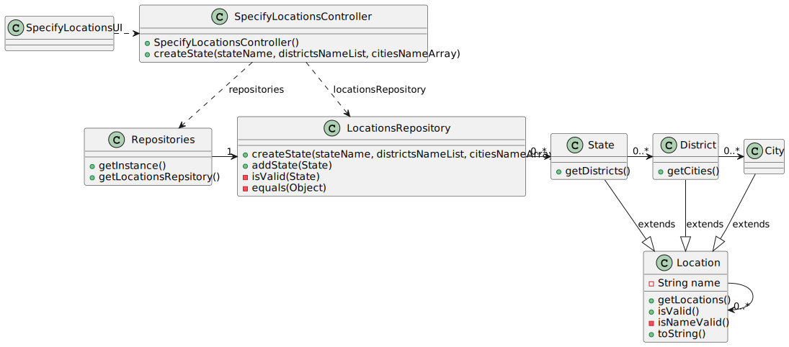

# US 006 - Specifying Locations

## 3. Design - User Story Realization

### 3.1. Rationale

**SSD - Alternative 1 is adopted.**

| Interaction ID | Question: Which class is responsible for...  | Answer                     | Justification (with patterns)                                                                                 |
|:---------------|:---------------------------------------------|:---------------------------|:--------------------------------------------------------------------------------------------------------------|
| Step 1         | ... interacting with the actor?              | SpecifyLocationsUI         | Pure Fabrication: there is no reason to assign this responsibility to any existing class in the Domain Model. |
|                | ... coordinating the US?                     | SpecifyLocationsController | Controller                                                                                                    |
|                | ... instantiating a new State?               | LocationsRepository        | Pure Fabrication: store all data(low coupling) / Creator (Rule 1)                                             |
| Step 2         |                                              |                            |                                                                                                               |
| Step 3         | ...saving the inputted data?                 | State                      | IE: object created in step 1 has its own data.                                                                |
| Step 4         |                                              |                            |                                                                                                               |
| Step 5         | ... instancing a new District?               | State                      | Creator (Rule 1): In the domain model State has Distritc(s).                                                  |
| Step 6         |                                              |                            |                                                                                                               |              
| Step 7         | ... instancing a new City?                   | District                   | _Creator (rule 1): In the Domain model District has City(ies).                                                |
|                | ... validating all data (local validation)?  | State                      | IE: owns its data.                                                                                            | 
|                |                                              | District                   | IE: owns its data.                                                                                            |
|                |                                              | City                       | IE: owns its data.                                                                                            |
|                | ... validating all data (global validation)? | LocationsRepository        | IE: knows all its States.                                                                                     | 
|                | ... saving the created task?                 | LocationsRepository        | IE: owns all its States.                                                                                      | 
| Step 8         | ... informing operation success?             | CreateTaskUI               | IE: is responsible for user interactions.                                                                     | 

### Systematization ##

According to the taken rationale, the conceptual classes promoted to software classes are:

* State
* District
* City

Other software classes identified:

* SpecifyLoacationsUI
* SpecifyLoacationsConroller
* LocationsRepository

## 3.2. Sequence Diagram (SD)

### Alternative 1 - Full Diagram

This diagram shows the full sequence of interactions between the classes involved in the realization of this user story.

## 3.3. Class Diagram (CD)

