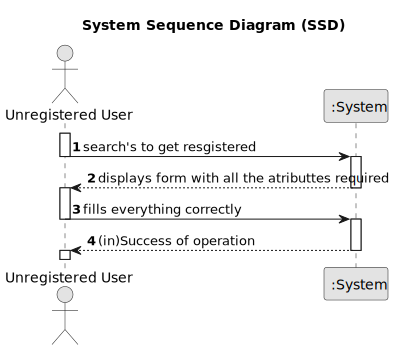

# US 007 - Registering a user

## 1. Requirements Engineering

### 1.1 User Story Description

As an unregistered user, I want to register in the system to buy, sell or rent
properties.

### 1.2 Customer Specifications and Clarifications

The owner attributes when registering are name, citizens card number,tax number,adress(optional) ,email adress,
telephone number.

**From client clarifications:**

> **Question:** Does the user also receive the password via email or can he choose a password when registering?
>
> **Answer:** The owner can choose a password when registering.

> **Question:** It was previously stated that an unregistered user could do a property listing request. However, with
> the introduction of US007, I want to clarify and make sure that now a user needs to be registered in order to buy, sell
> or rent properties, or if they can still do it unregistered.
>
> **Answer:** In Sprint B we introduce US7 and now, in US4, the owner needs to be registered in the system to submit a
> request for listing. You should update all artifacts to include this change.

### 1.3 Accpetance Criteria

* **AC1:** The User must fill,with the appropriate values, all the obligatory fields in order to get registered.
* **AC2** Some attributes are unique for each Client so when registering, in those attributes they can't put values that
  are already associated with other user.
* **AC3** Password must contain 7 alphanumeric characters, at least 3 capital letters and 2 digits.

### 1.4 Found out Dependencies

US004 - If the user intends to register to sell a property he must create a request.

### 1.5 Input and Output Data

**Input Data:**

+ Name
+ Citizen's card number
+ Tax number
+ Adress (optional)
+ Email adress
+ Password
+ Telephone number

**Output Data:**

* (In)Success of the operation.

### 1.6 System Sequence Diagram (SSD)

**Other alternatives might exist.**

### 1.7 Other Relevant Remarks

n/a