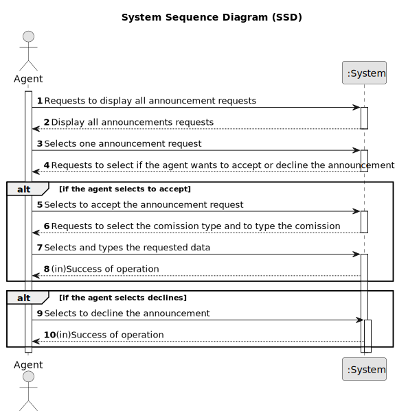

# US 008 - See the list of property announcements to accept or decline them

## 1. Requirements Engineering

### 1.1 User Story Description

As an agent, I intend to see the list of property announcement requests made to myself, so that I can post the announcement.

### 1.2 Customer Specifications  and Clarifications

**From client clarifications:**

### 1.3 Accpetance Criteria

* **AC1:** The list of property announcement requests should be sorted by the date
  they were created, with the most recent requests appearing first.
* **AC2:** An announcement is posted when a request is accepted. The list of requests
  should be refreshed, and that request should not be shown again.

### 1.4 Found out Dependencies

US004 - If the agent intends to see the list of property announcements requests made to himself first it must be created a request.

### 1.5 Input and Output Data

**Input Data:**

**Typed Data:**

* Comission

**Selected Data:**

* Comission type

**Output Data:**

* (In)Success of the operation.

### 1.6 System Sequence Diagram (SSD)

**Other alternatives might exist.**

### 1.7 Other Relevant Remarks

n/a