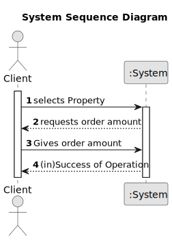

# US 010 - Request to buy or hire

## 1. Requirements Engineering

### 1.1. User Story Description
As a client, I  place an order to purchase the property, submitting the order amount.

### 1.2. Customer Specifications and Clarifications 

**From the specifications document:**

> When the client decides to buy/rent the property, he sends a request for the purchase/lease of the property to the agent.
> After being appreciated by the agent, he accepts or rejects the order.
> If the request is accepted, the offer won't show up anymore for any other clients.

**From the client clarifications:**

> **Question:** To order a purchase of a property, should the client be able to filter the properties by type of property, city, district....so that it's easier to find the wanted property, or should the system show the entire list of properties to sale?
>  
> **Answer:** The system should show a list of properties to the client. Filtering is a useful feature of the system, please prepare a user friendly and effective filtering to show the properties to the client.

> **Questions:** When showing the other order on the screen, what data should be shown (eg client name, published date, order status)?
> **Answer:** If the order amount submitted by the client has already been posted for the property (by another request from this client or any other client), the system must state that on the screen. The system should show the message "The order amount submitted has already been posted for this property. Please contact the agent that is responsible for this property.".

### 1.3. Acceptance Criteria

* **AC1:** The order amount submitted by the client must be equal to or lower than the price set by the owner for the property.
* **AC2** If the order amount submitted by the client has already been posted for the property (by another request from this client or any other client),the system must state that on the screen and the order placed previously should be considered first when selling the property.
* **AC3** A client can only submit a new order to purchase the same property after the previous one is declined.

### 1.4. Found out Dependencies

**US 002** - The list of properties from witch the client is going to choose are published by the agent in this US.  

### 1.5 Input and Output Data

**Input Data:** 
* Order amount

**Selected Data:**

* PropertySale

**Output Data:**

* (in)Success of operation

### 1.6. System Sequence Diagram (SSD)

**Other alternatives might exist.**

### 1.7 Other Relevant Remarks

n/a