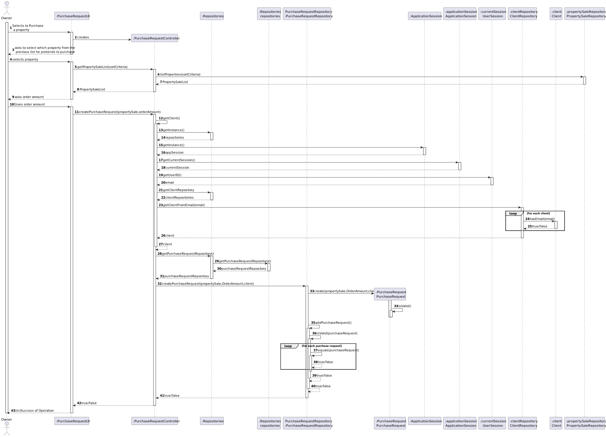
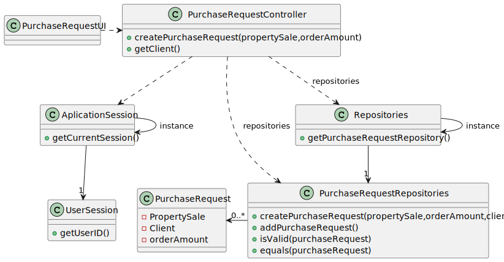

# US 004 - Submit a request to list a property 

## 3. Design 

### 3.1. Rationale

**SSD - Alternative 1 is adopted.**

| Interaction ID | Question: Which class is responsible for...                   | Answer                    | Justification (with patterns) |
|:---------------|:--------------------------------------------------------------|:--------------------------|:------------------------------|
| Step 1  		     | 	... interacting with the actor?                              | PurchaseRequestUI         | Pure Fabrication              |
|                | ...coordinating the US?                                       | PurchaseRequestController | Controller                    |
| Step 2         | ...knowing what the data to request?                          | PurchaseRequestUI         | Pure Fabrication              |
| Step 3         |                                                               |                           |                               | 
| Step 4         | ...creating the purchaseRequest?                              | PurchaseRequestRepository | IE:                           | 
|                | ...validating the introduced order amount(local validation)?  | PurchaseRequest           | IE:                           | 
|                | ...validating the created purchaseRequest(global validation)? | PurchaseRequestRepository | IE:                           | 
|                | ...saving the created purchaseRequest?                        | PurchaseRequestRepository | IE:                           | 
|                | ...inform (in)Success of operation                            | PurchaseRequestUI         | PF                            | 

### Systematization ##

According to the taken rationale, the conceptual classes promoted to software classes are:
 * PurchaseRequest

Other software classes (i.e. Pure Fabrication) identified: 

 * PurchaseRequestUI
 * PurchaseRequestController
 * PurchaseRequestRepository
## 3.2. Sequence Diagram (SD)

###  Full Diagram

This diagram shows the full sequence of interactions between the classes involved in the realization of this user story.

## 3.3 Class Diagram(CD)
