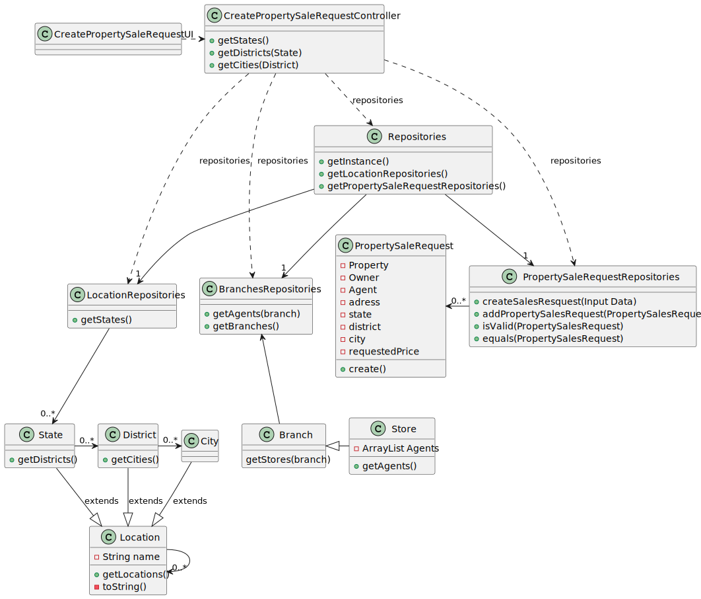

# US 004 - Submit a request to list a property 

## 3. Design 

### 3.1. Rationale

**SSD - Alternative 1 is adopted.**

| Interaction ID | Question: Which class is responsible for...                    | Answer                              | Justification (with patterns)                                 |
|:---------------|:---------------------------------------------------------------|:------------------------------------|:--------------------------------------------------------------|
| Step 1  		     | 	... interacting with the actor?                               | CreatePropertySaleRequestUI         | **Pure Fabrication:**                                         |
|                | ...coordinating the US?                                        | CreatePropertySaleRequestController | **Controller**                                                |
|                |                                                                | CreateRequestUI                     | **Pure Fabrication**                                          |
|                |                                                                | PropertyDTO                         | **InformationExpert:** knows the properties.                  |
|                |                                                                | ApartmentDTO                        | **InformationExpert:** knows the apartments.                  |
|                |                                                                | ResidentialPropertyDTO              | **InformationExpert:** knows the residential properties.      |
|                |                                                                | HouseDTO                            | **InformationExpert:** knows the houses.                      |
|                |                                                                | StoreRepository                     | **InformationExpert:** knows/owns all stores.                 |
|                |                                                                | TypeOfBusinesses                    | **InformationExpert:** knows the types of business options.   |
|                |                                                                | SunExposure                         | **InformationExpert:** knows the sun exposure options.        |
|                |                                                                | PropertySaleRequestRepository       | **InformationExpert:** knows/owns all property sale requests. |
|                |                                                                | PropertySaleRequest                 | **InformationExpert:** knows the property sale requests.      |
|                |                                                                | City                                | **InformationExpert:** knows the city.                        |
|                |                                                                | State                               | **InformationExpert:** knows the state.                       |
|                |                                                                | District                            | **InformationExpert:** knows the district.                    |
| Step 3         |                                                                |                                     |                                                               |
| Step 4         | ...know the agent from store                                   | StoreRepository                     | **InformationExpert:** knows own data                         |
| Step 5         |                                                                |                                     |                                                               |                                                                                                               |
| Step 8         | ...know state?                                                 | State                               | **InformationExpert:** knows own data                         |
| Step 9         | ... know available districts on selected state?                | District                            | **InformationExpert:** knows owm data                         |
| Step 10        | ...know available cities on selected district?                 | City                                | **InformationExpert:** knows owm data                         |
| Step 11        |                                                                |                                     |                                                               |
| Step 12        | ...know the attributes to request?                             | CreateRequestUI                     | **Pure Fabrication**                                          |
| Step 13        |                                                                |                                     |                                                               |
| Step 14        | ...temporarily saving type of business?                        | TypeOfBusinesses                    | **InformationExpert:** knows the type of business.            |
|                | ...temporarily saving the sun exposure?                        | SunExposure                         | **InformationExpert:** knows the sun exposure.                |
|                | ...temporarily saving the apartment input?                     | ApartmentDTO                        | **InformationExpert:** knows its own data.                    |
|                | ...temporarily saving the house input?                         | HouseDTO                            | **InformationExpert:** knows its own data.                    |
|                | ...temporarily saving the land input?                          | LandDTO                             | **InformationExpert:** knows its own data.                    |
| Step 15        | ...instantiating new PropertySalesRequest                      | PropertySaleRequestRepositories     | **Creator**                                                   |
|                | ...validating inputted attributes(local validation)?           | PropertySaleRequest                 | **InformationExpert:** Object created knows own data          |
|                | ...validating created PropertySalesRequest(global validation)? | PropertySaleRequestRepositories     | **InformationExpert:** Owns all PropertySaleRequest           |
|                | ...saving the input data?                                      | PropertySaleRequestRepositories     | **InformationExpert:** Object created knows own data          |
|                | ...saving new PropertySalesRequest?                            | PropertySaleRequestRepositories     | **InformationExpert:** Owns all PropertySaleRequest           |
|                | ...informing operation success?                                | CreatePropertySaleRequestUI         | **Pure Fabrication**                                          |

### Systematization ##

According to the taken rationale, the conceptual classes promoted to software classes are: 

 * Stores
 * PropertySaleRequest
 * City
 * State
 * District
 * TypeOfBusiness
 * SunExposure

Other software classes (i.e. Pure Fabrication) identified: 

 * CreatePropertySaleRequestUI
 * CreatePropertySaleRequestController
 * HouseDTO
 * ApartmentDTO
 * LandDTO
 * StoreRepository
 * PropertySaleRequestRepository

## 3.2. Sequence Diagram (SD)

###  Full Diagram

This diagram shows the full sequence of interactions between the classes involved in the realization of this user story.

## 3.3 Class Diagram(CD)
