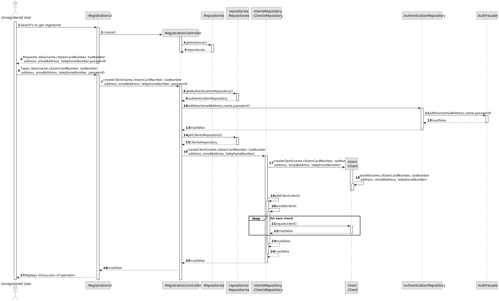
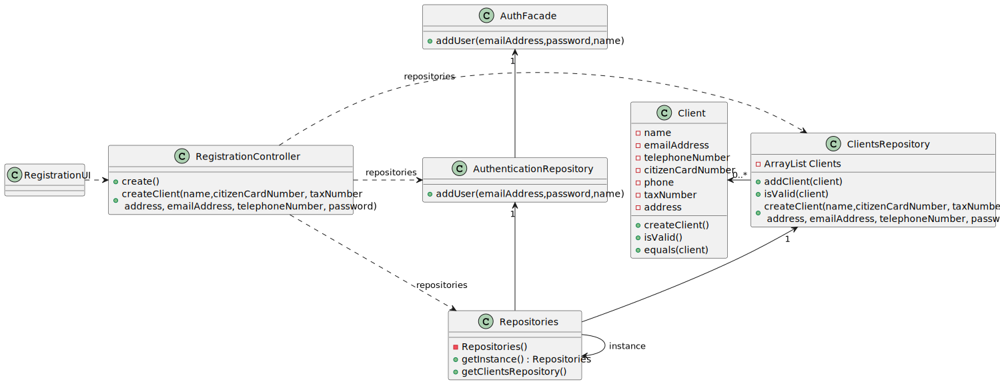

# US 007 - Registration 

## 3. Design - User Story Realization 

### 3.1. Rationale

**SSD - Alternative 1 is adopted.**

| Interaction ID | Question: Which class is responsible for...     | Answer                   | Justification (with patterns)                             |
|:---------------|:------------------------------------------------|:-------------------------|:----------------------------------------------------------|
| Step 1         | ...interacting with the user?                   | RegistrationUI           | **Pure Fabrication**                                      |
|                | ...coordinating the US                          | RegistrationController   | **Controller**                                            |
|                |                                                 | Client                   | **InformationExpert:** knows its own data (e.g. email).   |
|                |                                                 | ClientsRepository        | **InformationExpert:** knows/owns all clients.            |
|                |                                                 | AuthenticationRepository | **InformationExpert:** owns all users.                    |
|                |                                                 | AuthFacade               | **InformationExpert:** knows its own data.                |
|                |                                                 | ClientDTO                | **InformationExpert:** knows client data.                 |
|                |                                                 | UserDTO                  | **InformationExpert:** knows user data.                   |
|                |                                                 |                          |                                                           |
| Step 2         | ...knowing what attributes to ask for?          | RegistrationUI           | **Pure Fabrication.**                                     |
| Step 3         | ...instantiating new user?                      | AuthenticationRepository | **Creator.**                                              |
|                | ...validating user data(local validation)?      | AuthFacade               | **InformationExpert:** Created user knows its own data.   |
|                | ...adding the user?                             | AuthenticationRepository | **InformationExpert:** Owns all the users.                |
|                | ...temporarily saving client data?              | ClientDTO                | **InformationExpert:** knows client data.                 |
|                | ...temporarily saving user data?                | UserDTO                  | **InformationExpert:** knows user data.                   |
|                | ...saving the user?                             | AuthenticationRepository | **InformationExpert:** Owns all the users.                |
|                | ...validating the user(global validation)?      | AuthenticationRepository | **InformationExpert:** Knows its users.                   |
|                | ...validating input data(localValidation) ?     | Client                   | **InformationExpert:** Created client knows its own data. |
|                | ...saving the inputted data?                    | Client                   | **InformationExpert:** Created client has its own data.   |
|                | ...instantiating a new client?                  | ClientsRepository        | **Creator**                                               |
|                | ...validating created client(globalValidation)? | ClientsRepository        | **InformationExpert:** Knows all its clients.             |
|                | ...saving the created client?                   | ClientsRepository        | **InformationExpert:** Owns all clients .                 |
| Step 4         | informing success in the operation?             | RegistrationUI           | **Pure Fabrication**                                      |

### Systematization ##

According to the taken rationale, the conceptual classes promoted to software classes are: 

 * Client

Other software classes (i.e. Pure Fabrication) identified: 

 * RegistrationUI  
 * RegistrationController
 * ClientsRepository
 * AuthFacade
 * AuthenticationRepository
 * ClientDTO
 * UserDTO

## 3.2. Sequence Diagram (SD)

###  Full Diagram

This diagram shows the full sequence of interactions between the classes involved in the realization of this user story.

## 3.3 Class Diagram (CD)

