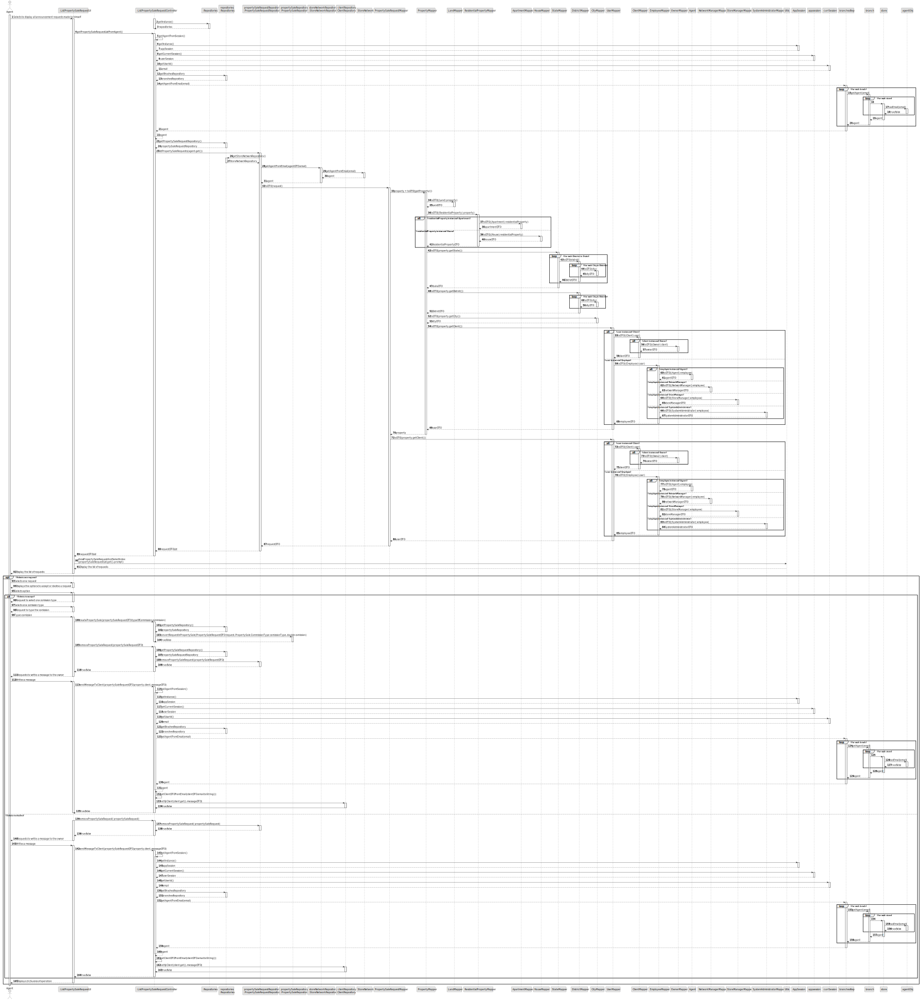
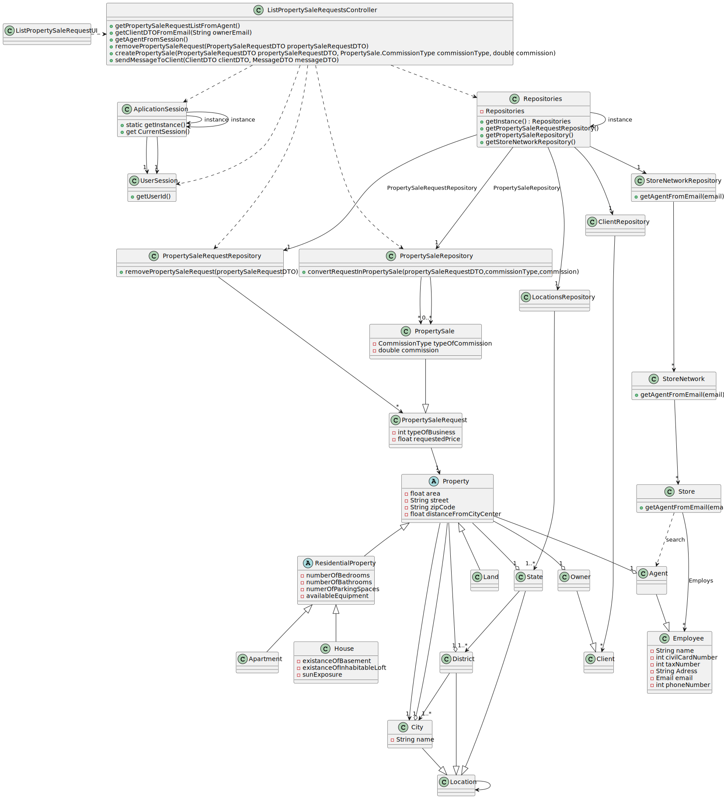

# US 008 - See the list of property announcements to accept or decline them

## 3. Design - User Story Realization 

### 3.1. Rationale

**SSD - Alternative 1 is adopted.**

| Interaction ID | Question: Which class is responsible for...      | Answer                            | Justification (with patterns)                                         |
|:---------------|:-------------------------------------------------|:----------------------------------|:----------------------------------------------------------------------|
| Step 1         | ...interacting with the user?                    | ListPropertySaleRequestUI         | Pure Fabrication                                                      |
|                | ...coordinating the US                           | ListPropertySaleRequestController | Controller                                                            |
| Step 2         | ...knowing the agent in the system?              | UserSession                       | IE : Knows all users                                                  |
|                | ...knowing the announcement requests to display? | PropertySaleRequestRepository     | IE : Owns all announcement requests                                   |
|                | ...knowing the announcement request details?     | PropertySaleRequest               | IE : Has its own data                                                 |
| Step 3         | ...saving the input data?                        | PropertySaleRequestRepository     | IE : Owns all announcement requests                                   |
| Step 4         |                                                  |                                   |                                                                       |
| Step 5         | ...knowing the announcement selected?            | PropertySaleRepository            | IE : Owns all announcement requests                                   |
|                | ...knowing the comission types?                  | PropertySale                      | IE : Knows its own data                                               |
|                | ...saving the comission?                         | PropertySale                      | IE : Knows its own data                                               |
|                | ...saving the created announcement?              | PropertySaleRequest               | IE : Owns all announcements                                           |
| Step 6         | ...informing success in the operation?           | ListPropertySaleRequestUI         | Pure Fabrication                                                      |
|                | ...sending the message to the client?            | Agent                             | IE : Responsible for creating the announcement and informing the user |

### Systematization ##

According to the taken rationale, the conceptual classes promoted to software classes are: 

 * PropertySale
 * PropertySaleRequest
 * Agent

Other software classes (i.e. Pure Fabrication) identified: 

 * ListPropertySaleRequestUI  
 * PropertySaleRequestRepository
 * PropertySaleRepository
 * UserSession

## 3.2. Sequence Diagram (SD)

###  Full Diagram

This diagram shows the full sequence of interactions between the classes involved in the realization of this user story.

## 3.3 Class Diagram (CD)

