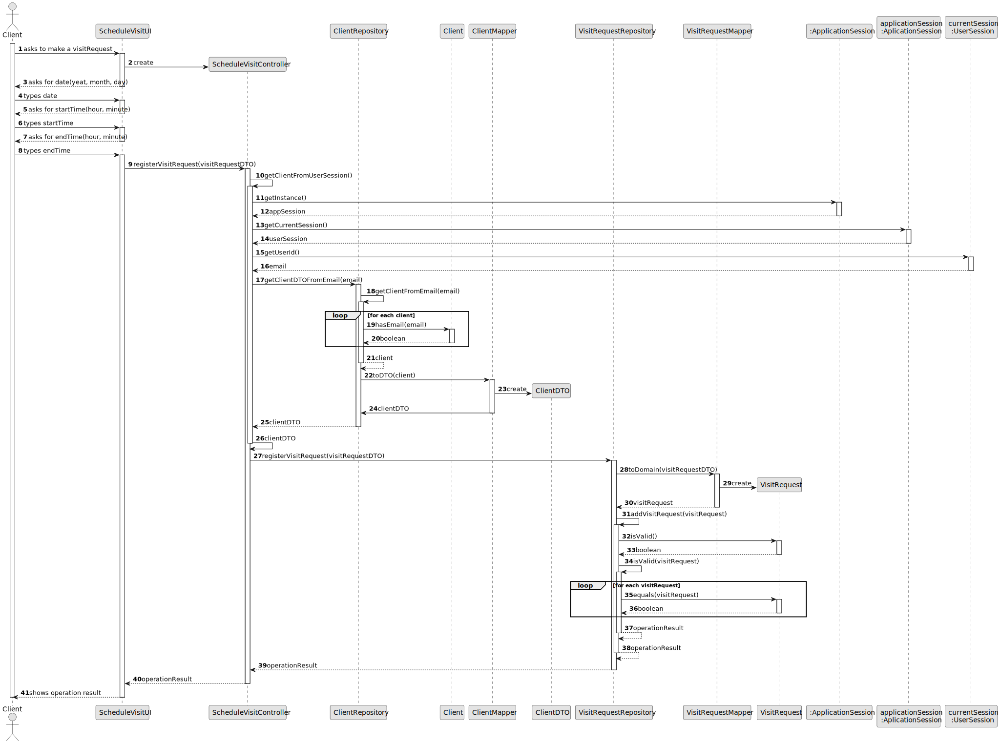

# US 002 - Publishing of any sale announcement

## 3. Design - User Story Realization

### 3.1. Rationale

**SSD - Alternative 1 is adopted.**

| Interaction ID | Question: Which class is responsible for...  | Answer                  | Justification (with patterns)                                                                                 |
|:---------------|:---------------------------------------------|:------------------------|:--------------------------------------------------------------------------------------------------------------|
| Step 1         |                                              |                         |                                                                                                               |
| Step 2         |                                              |                         |                                                                                                               |
| Step 3         |                                              |                         |                                                                                                               |
| Step 4         | ... interacting with the actor?              | ScheduleVisitRequesstUI | Pure Fabrication: there is no reason to assign this responsibility to any existing class in the Domain Model. |
|                | ... coordinating the US?                     | ScheduleVisitController | Controller                                                                                                    |
|                | ... instantiating a new VisitRequest?        | VisitRequestRepository  | Pure fabrication: no containers yet. Creator (Rule 1)                                                         |
|                | ... knowing the data?                        | VisitRequest            | IE: knows its own data                                                                                        |
|                | ... knowing the user using the system?       | UserSession             | IE: cf. A&A component documentation.                                                                          |
|                |                                              | ClientRepository        | IE: has its own clients.                                                                                      |
|                |                                              | Client                  | IE: knows its own data (e.g. email).                                                                          |
| Step 5         | ... saving the inpute data                   | VisitRequestDTO         | IE: knows its own data                                                                                        |
| Step 6         |                                              |                         |                                                                                                               |
| Step 7         |                                              |                         |                                                                                                               |
| Step 8         |                                              |                         |                                                                                                               |
| Step 9         |                                              |                         |                                                                                                               |
| Step 10        | ... changing DTO to domain?                  | VisitRequestMapper      | Pure Fabrication: no class has this responsibility yet.                                                       |
|                | ... validating all data (local validation)?  | VisitRequest            | IE: knows its owwn data.                                                                                      |
|                | ... validating all data (global validation)? | VisitRequestRepository  | IE: has its own visit requests                                                                                |
|                | ... saving the created visit request?        | VisitRequestRepository  | IE: has its own visit requests                                                                                |
|                | ... informing the operation success?         | ScheduleVisitUI         | UI: this class interacts with the user                                                                        |

### Systematization ##

According to the taken rationale, the conceptual classes promoted to software classes are:

* Client
* VisitRequest

Other software classes (i.e. Pure Fabrication) identified:

* ScheduleVisitRequestUI
* ScheduleVisitController
* VisitRequestRepository
* UserSession

## 3.2. Sequence Diagram (SD)

### Alternative 1 - Full Diagram

This diagram shows the full sequence of interactions between the classes involved in the realization of this user story.

## 3.3. Class Diagram (CD)

