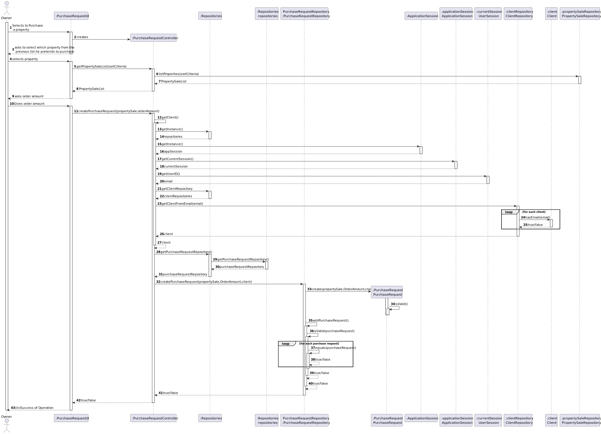
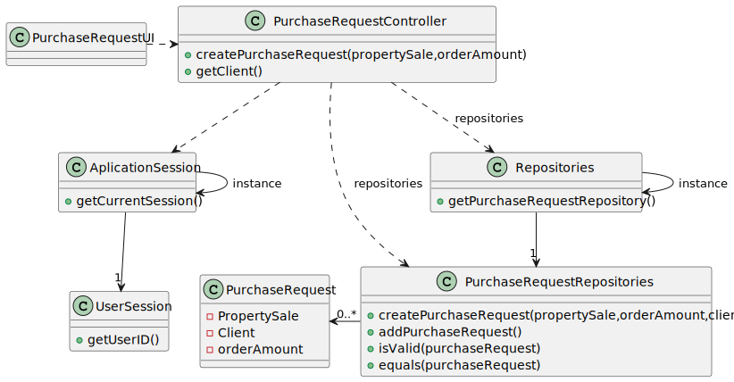

# US 004 - Submit a request to list a property 

## 3. Design 

### 3.1. Rationale

**SSD - Alternative 1 is adopted.**

| Interaction ID | Question: Which class is responsible for...                   | Answer                    | Justification (with patterns)                          |
|:---------------|:--------------------------------------------------------------|:--------------------------|:-------------------------------------------------------|
| Step 1  		     | 	... interacting with the actor?                              | PurchaseRequestUI         | **Pure Fabrication.**                                  |
|                | ...coordinating the US?                                       | PurchaseRequestController | **Controller.**                                        |
|                |                                                               | PurchaseRequest           | **InformationExpert:** knows its data.                 |
|                |                                                               | PropertySaleRepository    | **InformationExpert:** knows all properties sale.      |
|                |                                                               | ClientRepository          | **InformationExpert:** knows all clients.              |
|                |                                                               | PurchaseRequestDTO        | **InformationExpert:** knows the purchase requests.    |
|                |                                                               |                           |                                                        |
| Step 2         | ...knowing what the data to request?                          | PurchaseRequestUI         | **Pure Fabrication.**                                  |
| Step 3         |                                                               |                           |                                                        | 
| Step 4         | ...creating the purchaseRequest?                              | PurchaseRequestRepository | **InformationExpert:** owns the purchase requests.     | 
| Step 5         | ...validating the introduced order amount(local validation)?  | PurchaseRequest           | **InformationExpert:** knows its data.                 | 
| Step 6         | ...validating the created purchaseRequest(global validation)? | PurchaseRequestRepository | **InformationExpert:** knows all purchase request.     | 
| Step 7         | ...saving the created purchaseRequest?                        | PurchaseRequestRepository | **InformationExpert:** owns all the purchase requests. | 
| Step 8         | ...temporarily saving purchase request?                       | PurchaseRequestDTO        | **InformationExpert:** knows its data.                 |
| Step 9         | ...knowing the client associated with a property?             | PropertySaleRepository    | **InformationExpert:** knows its own data.             |
| Step 10        | ...having the client information?                             | ClientRepository          | **InformationExpert:** knows all clients.              |
| Step 11        | ...inform (in)Success of operation                            | PurchaseRequestUI         | **Pure Fabrication.**                                  | 

### Systematization ##

According to the taken rationale, the conceptual classes promoted to software classes are:

 * PurchaseRequest

Other software classes (i.e. Pure Fabrication) identified: 

 * PurchaseRequestUI
 * PurchaseRequestController
 * PurchaseRequestRepository
 * ClientRepository
 * PurchaseRequestDTO
 * PropertySaleRepository

## 3.2. Sequence Diagram (SD)

###  Full Diagram

This diagram shows the full sequence of interactions between the classes involved in the realization of this user story.

## 3.3 Class Diagram(CD)
