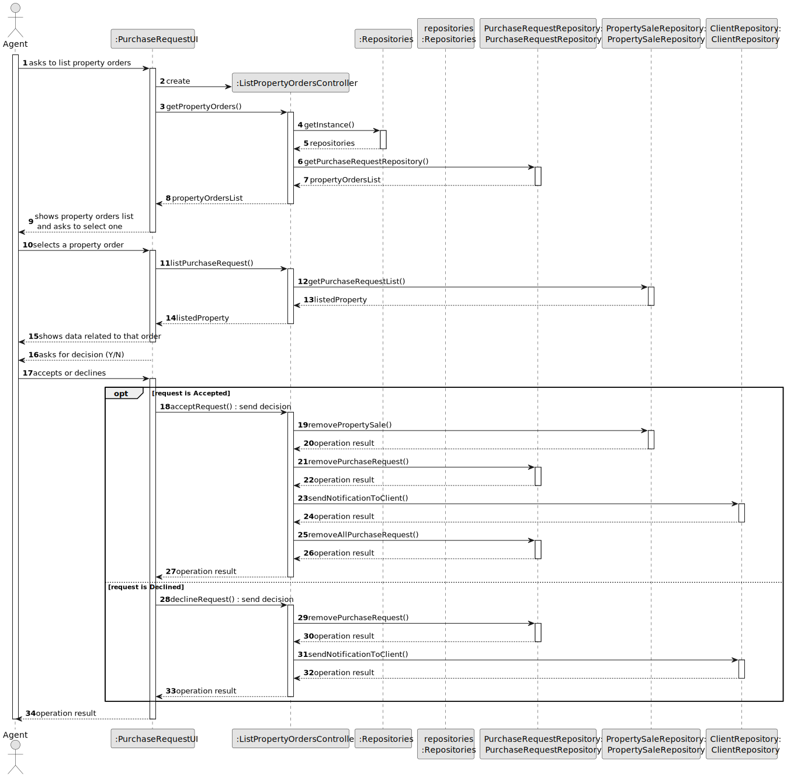
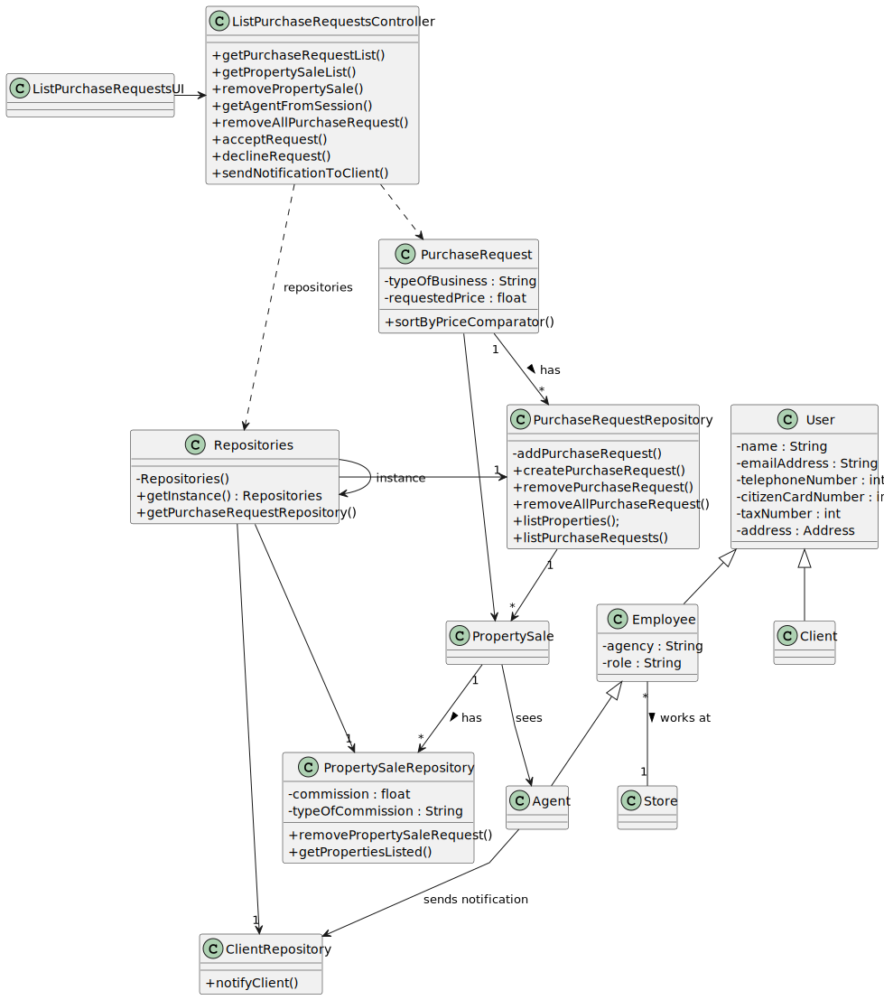

# US 011 - Accept or decline a request 

## 3. Design - User Story Realization 

### 3.1. Rationale

| Interaction ID | Question: Which class is responsible for...   | Answer                       | Justification (with patterns)                                                                                     |
|:---------------|:----------------------------------------------|:-----------------------------|:------------------------------------------------------------------------------------------------------------------|
| Step 1  		     | 	... interacting with the actor?              | ListPropertyOrdersUI         | **Pure Fabrication:** there is no reason to assign this responsibility to any existing class in the Domain Model. |
| 			  		        | 	... coordinating the US?                     | ListPropertyOrdersController | **Controller**                                                                                                    |
| 			  		        | 	... instantiating a new List of properties?  | PropertySale                 | **Creator (Rule 1):** in the DM PropertyOrders has the orders for the properties.                                 |
|                |                                               | PropertySale                 | **Information Expert:** knows it's own data                                                                       |
|                |                                               | PurchaseRequest              | **Information Expert:** knows it's own data                                                                       |
|                |                                               | ClientRepository             | **Information Expert:** owns all clients                                                                          |
|                |                                               | PropertySaleRepository       | **Information Expert:** owns all properties for sale                                                              |
|                |                                               | PurchaseRequestRepository    | **Information Expert:** owns all purchase requests                                                                |                                                   |
| Step 2  		     | 							                                       |                              |                                                                                                                   |
| Step 3  		     | 	...listing and sorting all properties?       | PropertySaleRepository       | **Information Expert:** knows all properties to be listed.                                                        |
| Step 4         | ... listing all purchase requests?            | PurchaseRequestRepository    | **Information Expert:** knows all purchase requests.                                                              | 
| Step 5         | ...saving which Property was selected?        | PurchaseRequest              | **Information Expert:** knows its data                                                                            | 
| Step 6  		     | 	... validating all data (local validation)?  | PurchaseRequest              | **Information Expert:** owns its data.                                                                            | 
| 			  		        | 	... validating all data (global validation)? | PurchaseRequestRepository    | **Information Expert:** knows all requests                                                                        |
| Step 7         | ...sending email to client with decision?     | ClientRepository             | **Information Expert:** owns the client and knows the message                                                     |
| Step 8  		     | 	... informing operation success?             | ListPropertyOrdersUI         | **Information Expert:** is responsible for user interactions.                                                     | 

### Systematization ##

According to the taken rationale, the conceptual classes promoted to software classes are: 

 * PropertySale
 * PurchaseRequest

Other software classes (i.e. Pure Fabrication) identified: 

 * ListPropertyOrdersUI  
 * ListPropertyOrdersController
 * ClientRepository
 * PropertySaleRepository
 * PurchaseRequestRepository

## 3.2. Sequence Diagram (SD)

This diagram shows the full sequence of interactions between the classes involved in the realization of this user story.

## 3.3. Class Diagram (CD)

