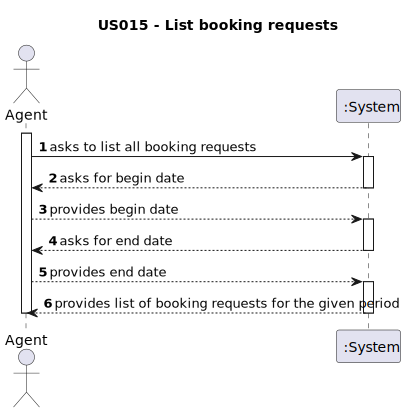

# US 015 - Listing Booking requests

## 1. Requirements Engineering

### 1.1. User Story Description

As an Agent, I intend to list all booking requests for properties managed by me.

### 1.2. Customer Specifications and Clarifications 

**From the client clarifications:**

> **Q:** Booking is a slightly vague word. Our team wants clarifications on what type of requests the word encompasses (visit requests being our strongest guess, but we are not sure).
> 
> **A:** It is a visit request.

> **Q:** AC1 states that "The list of requests must be shown for a specific period (begin date, end date)". As such, our team would like to know if you want this time period to be selected or typed, and in which format it should be in.
> 
> **A:** The dates should be selected. The format should be DD-MM-YYYY.

> **Q:** It is stated that "the list of requests must be shown for a specific period (begin date, end date)". This time period caused confusion, as the team is unsure whether the "date" is referring to the date chosen by the client in the message (See US009 requirements) or the date of creation of the visit request.
> 
> **A:** The goal is to use the date chosen by the client (the preferred date that you can see in US009) to list booking requests.

### 1.3. Acceptance Criteria

- **AC1:** The list of requests must be shown for a specific period (begin date, end date).
- **AC2:** The list of requests must be sorted by the date in ascending order. The sorting algorithm to be used by the application must be defined through a configuration file. At least two sorting algorithms should be available.

### 1.4. Found out Dependencies

This us is dependent on us009 as a client must make a visit request before it can be listed.

### 1.5 Input and Output Data

**Input Data:**

- Typed data
  - Begin date
  - End date

**Output Data:**
- Visit request list

### 1.6. System Sequence Diagram (SSD)

