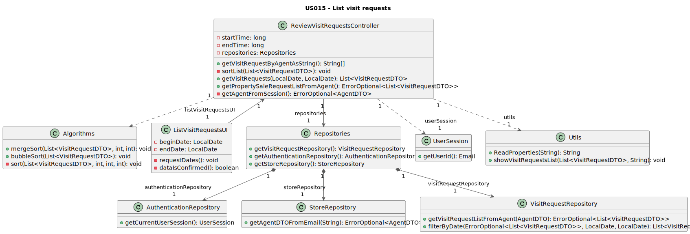

# US 015 - List booking requests 

## 3. Design - User Story Realization 

### 3.1. Rationale

| Interaction ID | Question: Which class is responsible for... | Answer                      | Justification (with patterns)                                                                                     |
|:---------------|:--------------------------------------------|:----------------------------|:------------------------------------------------------------------------------------------------------------------|
| Step 1         | ... interacting with the user?              | ListVisitRequestsUI         | **Pure Fabrication:** there is no reason to assign this responsibility to any existing class in the Domain Model. |
|                | ... coordinating the US?                    | ListVisitRequestsController | **Controller**                                                                                                    |
| Step 2         |                                             |                             |                                                                                                                   |
| Step 3         |                                             |                             |                                                                                                                   |
| Step 4         |                                             |                             |                                                                                                                   |
| Step 5         |                                             |                             |                                                                                                                   |                                                                                                              
| Step 6         | ... showing the request list?               | ListVisitRequestsUI         | **Pure Fabrication:** there is no reason to assign this responsibility to any existing class in the Domain Model. |
|                | ... validating the dates?                   | VisitRequest                | **Information Expert:** knows its own data                                                                        |
|                | ... retrieving the request list?            | ListVisitRequestsController | **Controller**                                                                                                    |
|                | ... storing the request list?               | VisitRequestRepository      | **Information Expert** knows all visit requests.                                                                  |
|                | ... sorting the request list?               | Algorithms                  | **Pure Fabrication** there is no reason to assign this responsibility to any existing class in the Domain Model.  |
|                | ... moving the data around?                 | VisitRequestDTO             | **Data Transfer Object** reduces coupling                                                                         |

### Systematization 

According to the taken rationale, the conceptual classes promoted to software classes are: 

* VisitRequest

Other software classes (i.e. Pure Fabrication) identified: 

* ListVisitRequestsUI
* ListVisitRequestsController
* VisitRequestRepository
* VisitRequestDTO
* Algorithms

## 3.2. Sequence Diagram (SD)

## 3.3. Class Diagram (CD)
