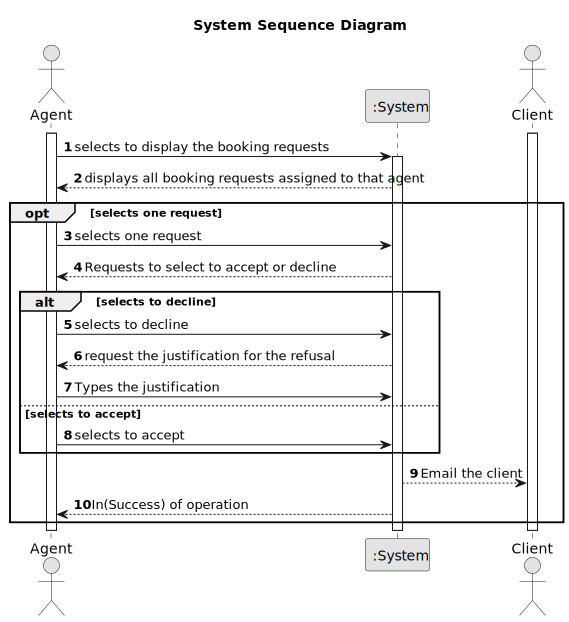

# US 016 - Review visit request

## 1. Requirements Engineering

### 1.1. User Story Description
As an agent, when viewing a booking request, I want to respond to the user that scheduled the visit.

### 1.2. Customer Specifications and Clarifications 

**From the specifications document:**

**From the client clarifications:**

### 1.3. Acceptance Criteria

* **AC1:** The response is sent by email.
* **AC2** Different email services can send the message. These services must be configured using a configuration file to enable using different platforms (e.g.:gmail, DEI's email service, etc.)
* **AC3** The response should include the name and phone number of the responsible Agent.
* **AC4** The response should include the property identification and location.
* **AC5** When an Agent responds to a booking request the list of booking requests should be updated to not show this request.

### 1.4. Found out Dependencies

**US 009** - The requests to which the agent will respond are created by the clients in this US. 

### 1.5 Input and Output Data

**Input Data:** 
* Response

**Selected Data:**

* Accept or decline
* VisitRequest

**Output Data:**

* Reponse by email 
* (in)Success of operation

### 1.6. System Sequence Diagram (SSD)

**Other alternatives might exist.**

### 1.7 Other Relevant Remarks

n/a