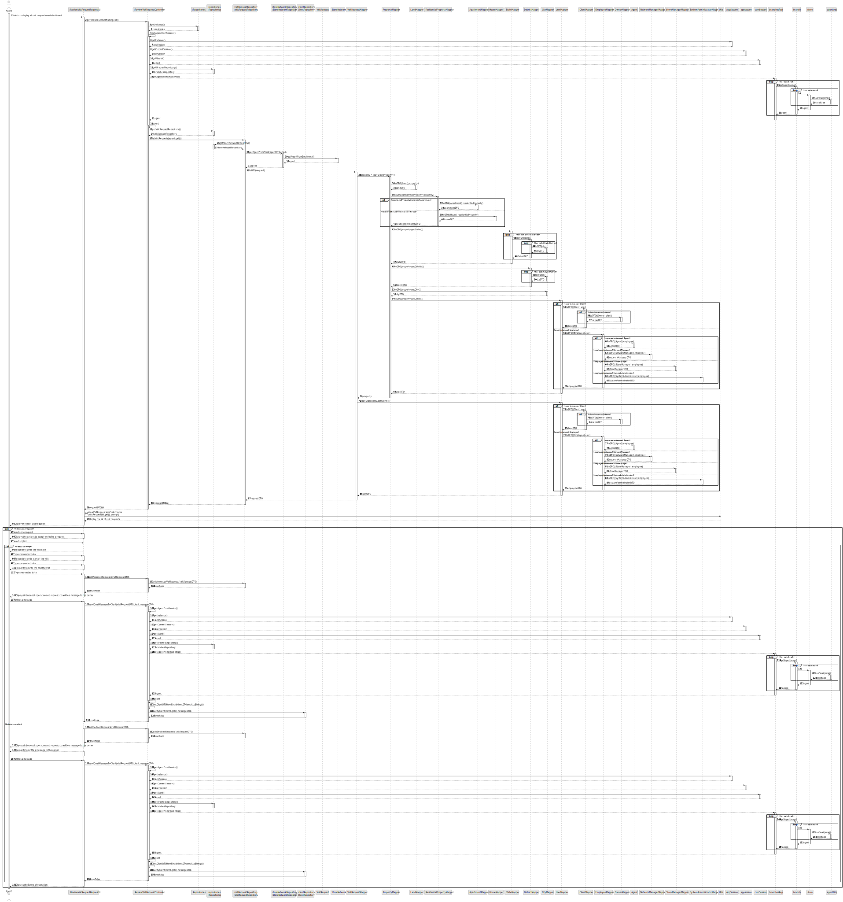
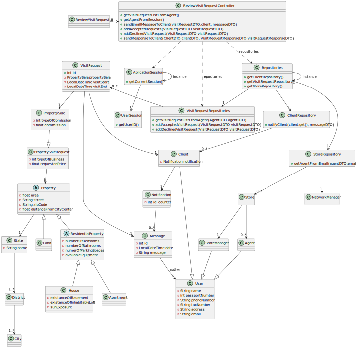

# US 016 - Review visit request

## 3. Design 

### 3.1. Rationale

**SSD - Alternative 1 is adopted.**

| Interaction ID | Question: Which class is responsible for... | Answer                       | Justification (with patterns)      |
|:---------------|:--------------------------------------------|:-----------------------------|:-----------------------------------|
| Step 1         | ...interacting with the actor?              | ReviewVisitRequestUI         | Pure Fabrication                   |
|                | ...coordinating the US?                     | ReviewVisitRequestController | Controller                         |
| Step 2         | ...knowing the requests to display?         | VisitRequestRepository       | IE: Has all visit requests         |
|                | ...knowing the agent in the system?         | UserSession                  |                                    |
|                | ...knowing the visit details to display?    | VisitRequest                 | IE: Knows its own attributes       |
| Step 3         | ...saving the input data?                   | ReviewVisitRequestUI         | Pure Fabrication                   | 
| Step 4         |                                             |                              |                                    | 
| Step 5         | ...saving the input data?                   | ReviewVisitRequestUI         | Pure Fabrication                   | 
| Step 6         |                                             |                              |                                    | 
| Step 7         | ...saving the input data?                   | EmailServices                | IE: Method used to send the emails | 
| Step 8         | ...saving the input data?                   | ReviewVisitRequestUI         | Pure Fabrication                   |
| Step 9         | ...sending the email to the client?         | EmailServices                | IE: Method used to send the emails |
|                | ...inform (in)Success of operation          | ReviewVisitRequestUI         | Pure Fabrication                   | 

### Systematization ##

According to the taken rationale, the conceptual classes promoted to software classes are:
 * VisitRequest
 * EmailServices

Other software classes (i.e. Pure Fabrication) identified: 

 * ReviewVisitRequestUI
 * ReviewVisitRequestController
 * VisitRequestRepository
 * UserSession

## 3.2. Sequence Diagram (SD)

###  Full Diagram

This diagram shows the full sequence of interactions between the classes involved in the realization of this user story.

## 3.3 Class Diagram(CD)
