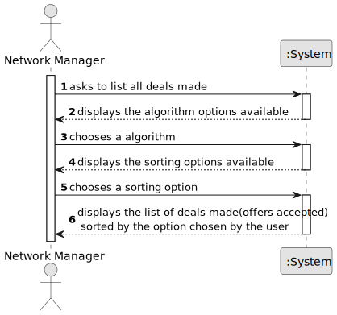

# US 017 - List deals made 

## 1. Requirements Engineering

### 1.1. User Story Description

As a network manager, I want to list all deals made.

### 1.2. Customer Specifications and Clarifications 

**From the specifications document:**

>   The main functions of a store manager are to monitor and streamline the branch with the aim of getting to know better the business carried out.

>	The manager of the network intends to analyze the performance of each of the branches and the global behavior of the network daily.

**From the client clarifications:**

> **Question:** Can you confirm that we are analyzing the deals made in all the branches all together?
>  
> **Answer:** Yes, we are analyzing the deals made in all the branches all together.

> **Question:** In this User Story it is requested that "All deals made" are listed. Are these deals just accepted purchase requests, or are declined purchase requests also included?
>  
> **Answer:** A deal takes place when the proposed purchase/renting is accepted.

### 1.3. Acceptance Criteria

* **AC1:** The actor should be able to sort all properties by property area (square feet) in descending/ascending order.
* **AC2:** Two sorting algorithms should be implemented (to be chosen manually by the network manager).
* **AC3:** Worst-case time complexity of each algorithm should be documented in the application user manual that must be delivered with the application (in the annexes, where algorithms should be written in pseudocode).

### 1.4. Found out Dependencies

* There is a dependency to "US011 Accept or decline a request" since "all the deals made" described in US017, are the deals accepted from US011. 

### 1.5 Input and Output Data

**Input Data:**

* Typed data:
	
* Selected data:
	* sorting option
    * algorithm option

**Output Data:**

* All deals made by the sorting and algorithm option selected

### 1.6. System Sequence Diagram (SSD)

**Other alternatives might exist.**

### 1.7 Other Relevant Remarks

n/a