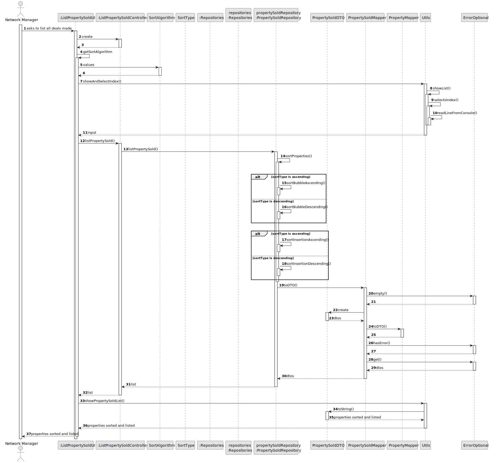
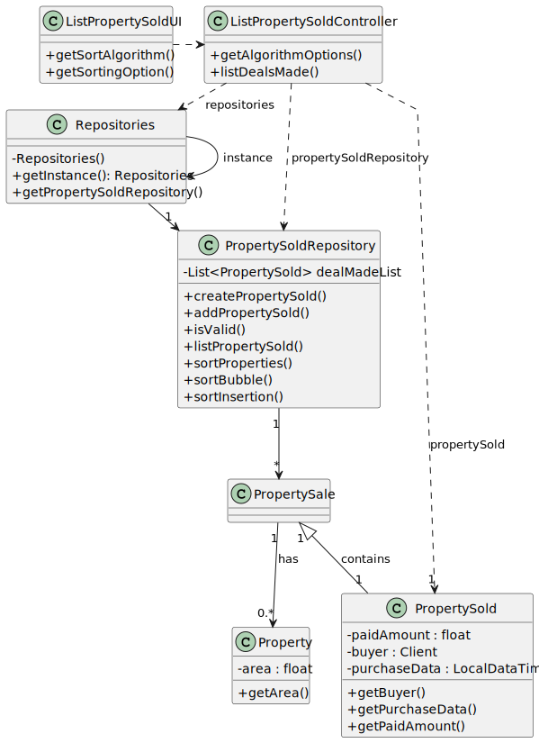

# US 017 - List deals made 

## 3. Design - User Story Realization 

### 3.1. Rationale

**SSD - Alternative 1 is adopted.**

| Interaction ID | Question: Which class is responsible for...   | Answer                     | Justification (with patterns)                                                                                     |
|:---------------|:----------------------------------------------|:---------------------------|:------------------------------------------------------------------------------------------------------------------|
| Step 1  		     | 	... interacting with the actor?              | ListPropertySoldUI         | **Pure Fabrication:** there is no reason to assign this responsibility to any existing class in the Domain Model. |
| 			  		        | 	... coordinating the US?                     | ListPropertySoldController | **Controller**                                                                                                    |
| 			  		        | 	... instantiating a new PropertySold?        | PropertySoldRepository     | **Creator (Rule 1):** in the DM PropertySoldRepository has a PropertySold.                                        |
| 			  		        | ... knowing the user using the system?        | UserSession                | **InformationExpert:**: cf. A&A component documentation.                                                          |
| 			  		        | 							                                       | PropertySold               | **InformationExpert:**: knows/has all the sold properties                                                         |
| 			  		        | 							                                       | Property                   | **InformationExpert:** knows its own data (e.g. area)                                                             |
|                |                                               | PropertySoldRepository     | **InformationExpert:** contains all properties sold.                                                              |
|                |                                               | SortAlgorithm              | **InformationExpert:** knows the sorting algorithms.                                                              |
|                |                                               | SortType                   | **InformationExpert;** knows the sorting options.                                                                 |
|                |                                               | PropertySoldDTO            | **InformationExpert:** used to transfer the property.                                                             |
| Step 2  		     | 							                                       |                            |                                                                                                                   |
| Step 3  		     | 	...saving the selected algorithm?            | SortAlgorithm              | **InformationExpert:** object created in step 1 has its own data.                                                 |
| Step 4  		     | 	...saving the selected sorting option?       | SortType                   | **InformationExpert:** object created in step 1 has its own data.                                                 |
| Step 5  		     | 							                                       |                            |                                                                                                                   |              
| Step 6  		     | 	... validating all data (local validation)?  | PropertySold               | InformationExpert:** owns its data.                                                                               | 
| 			  		        | 	... validating all data (global validation)? | PropertySoldRepository     | **InformationExpert:** knows all properties sold                                                                  | 
| 			  		        | 	... saving the created property sold?        | PropertySoldRepository     | **InformationExpert:** owns all properties sold                                                                   | 
| Step 7         | ... sorting the properties?                   | PropertySoldRepository     | **InformationExpert:** knows all properties sold.                                                                 |
| Step 8         | .. temporarily storing to properties sold?    | PropertySoldDTO            | **InformationExpert:** object created in step 1 is used to transfer data.                                         |
| Step 9  		     | 	... informing operation success?             | ListPropertySoldUI         | **Information:** is responsible for user interactions.                                                            | 

### Systematization ##

According to the taken rationale, the conceptual classes promoted to software classes are: 

 * PropertySold
 * Property

Other software classes (i.e. Pure Fabrication) identified: 

 * ListPropertySoldUI  
 * ListPropertySoldController
 * PropertySoldRepository
 * Repositories
 * SortAlgorithm
 * SortType
 * PropertySoldDTO
 * 

## 3.2. Sequence Diagram (SD)

### Alternative 1 - Full Diagram

This diagram shows the full sequence of interactions between the classes involved in the realization of this user story.

## 3.3 Class Diagram (CD)

