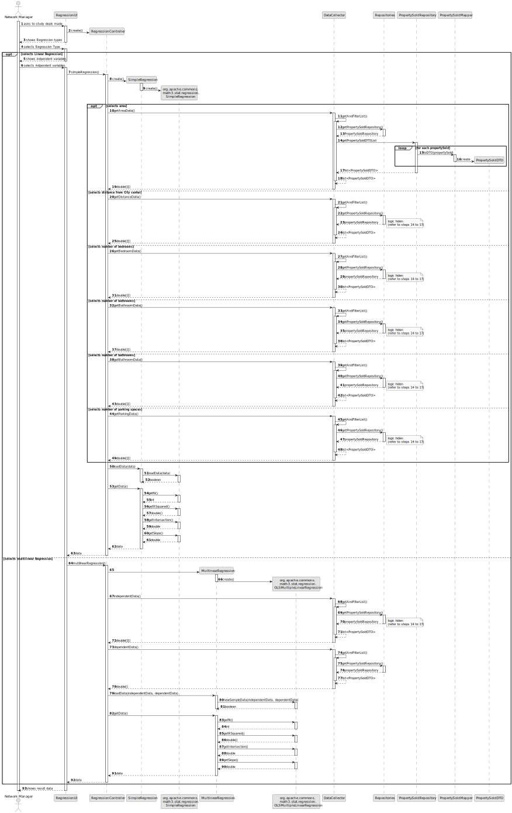
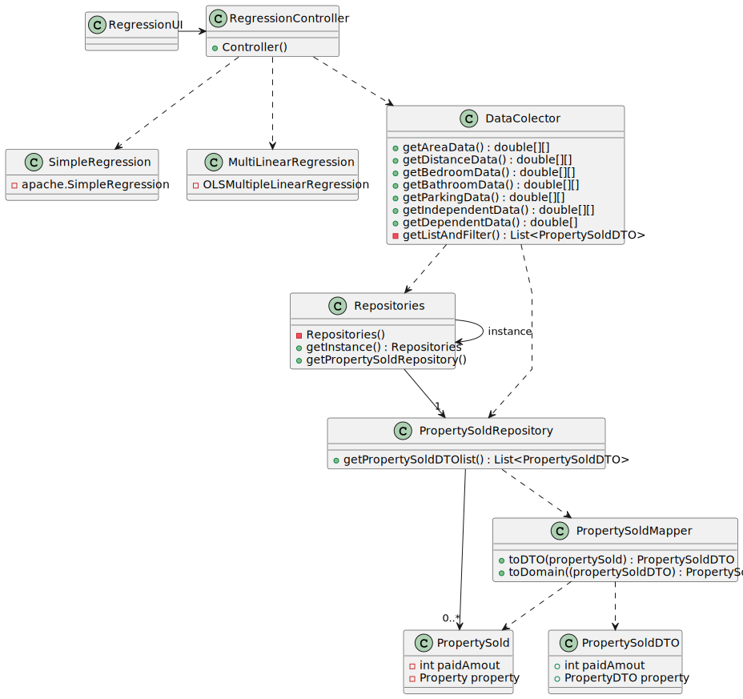

# US 006 – To create a Task 

## 3. Design – User Story Realization 

### 3.1. Rationale

**SSD — Alternative 1 is adopted.**

| Interaction ID | Question: Which class is responsible for...      | Answer                 | Justification (with patterns)                                                                                 |
|:---------------|:-------------------------------------------------|:-----------------------|:--------------------------------------------------------------------------------------------------------------|
| Step 1         | ... interacting with the actor?                  | RegressionUI           | Pure Fabrication: there is no reason to assign this responsibility to any existing class in the Domain Model. |
|                | ... coordinating the US?                         | RegressionController   | Controller                                                                                                    |
| Step 2         | ... getting the necessary data for the model?    | DataCollector          | Pure Fabrication: there is no reason to assign this responsibility to any existing class in the Domain Model. |
|                | ... getting the property deals?                  | Repositories           | IE: contains propertySoldRepository                                                                           |
|                | ... getting the property deals?                  | PropertySoldRepository | IE: contains PropertySolds                                                                                    |
|                | ... knowing the property deals details?          | PropertySold           | IE: knows it's own data                                                                                       |
|                | ... mapping the property to DTOs?                | PropertySoldMapper     | Pure Fabrication: there is no reason to assign this responsibility to any existing class in the Domain Model. |
|                | ... calculating the Linear regression model?     | SimpleRegression       | Pure Fabrication: there is no reason to assign this responsibility to any existing class in the Domain Model. |
|                | ... calculating the Multiliner regression model? | MultiLinearRegression  | Pure Fabrication: there is no reason to assign this responsibility to any existing class in the Domain Model. |
| Step 5         |                                                  |                        |                                                                                                               |
| Step 6         | ... showing the results?                         | RegressionUI           | Pure Fabrication                                                                                              |

### Systematization ##

According to the taken rationale, the conceptual classes promoted to software classes are: 

 * PropertySold

Other software classes (i.e., Pure Fabrication) identified: 

 * PropertySoldMapper
 * PropertySoldRepository
 * Repositories
 * RegressioUI
 * RegressionController
 * DataCollector
 * SimpleRegression
 * MultiLinearRegression

## 3.2. Sequence Diagram (SD)

### Alternative 1 - Full Diagram

This diagram shows the full sequence of interactions between the classes involved in the realization of this user story.

## 3.3. Class Diagram (CD)

