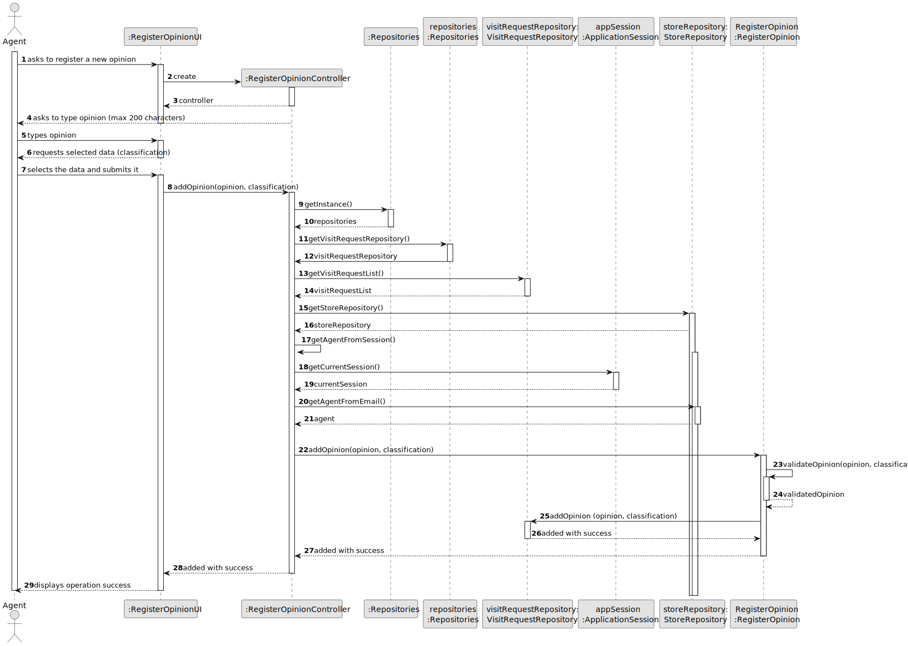
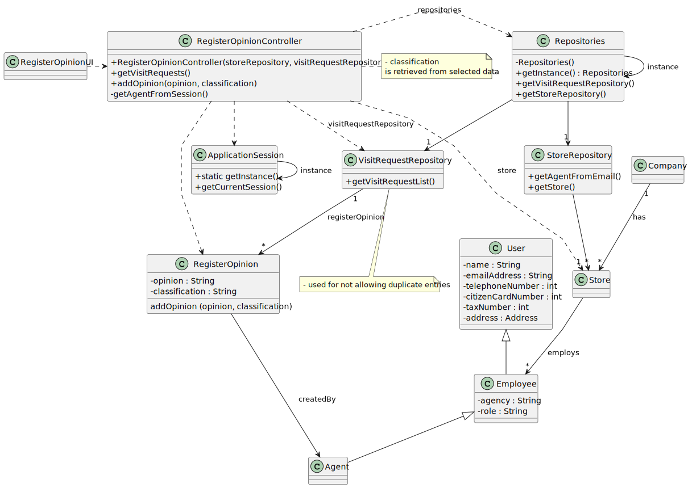

# US 006 - To create a Task 

## 3. Design - User Story Realization 

### 3.1. Rationale

**SSD - Alternative 1 is adopted.**

| Interaction ID | Question: Which class is responsible for...   | Answer                    | Justification (with patterns)                                                                                     |
|:---------------|:----------------------------------------------|:--------------------------|:------------------------------------------------------------------------------------------------------------------|
| Step 1  		     | 	... interacting with the actor?              | RegisterOpinionUI         | **Pure Fabrication:** there is no reason to assign this responsibility to any existing class in the Domain Model. |
| 			  		        | 	... coordinating the US?                     | RegisterOpinionController | **Controller**                                                                                                    |
| 			  		        | 	... instantiating a new Task?                | Organization              | **Creator (Rule 1):** in the DM Organization has a Task.                                                          |
| 			  		        | ... knowing the user using the system?        | ApplicationSession        | **InformationExpert:** cf. A&A component documentation.                                                           |
| 			  		        | 							                                       | Store                     | **InformationExpert:** knows/has its own Employees                                                                |
| 			  		        | 							                                       | Employee                  | **InformationExpert:** knows its own data (e.g. email)                                                            |
|                |                                               | RegisterOpinion           | **InformationExpert:** knows its own data                                                                         |
|                |                                               | Repositories              | **InformationExpert:** responsible for storing all repositories                                                   |
|                |                                               | VisitRequestRepository    | **InformationExpert:** responsible for storing all opinions registered                                            |
|                |                                               | StoreRepository           | **InformationExpert:** knows all employees and agents                                                             | 
| Step 2               |   		                                    | 				 			                  |                                                                                                                   |                                                                                                               |
| Step 3  		     | 	...saving the inputted data?                 | RegisterOpinion           | **InformationExpert:** object created in step 1 has its own data.                                                 |
| Step 4  		     | 	...checking for a duplicate entry            | VisitRequestRepository    | **InformationExpert:** knows all opinions registered                                                              |
| Step 5  		     | 	... saving the selected data?                | RegisterOpinion           | **InformationExpert:** object created in step 1 is classified in one Category.                                    |
| Step 6  		     | 							                                       |                           |                                                                                                                   |              
| Step 7  		     | 	... validating all data (local validation)?  | RegisterOpinion           | **InformationExpert:** owns its data.                                                                             | 
| 			  		        | 	... validating all data (global validation)? | VisitRequestRepository    | **InformationExpert:** knows all its opinions.                                                                    | 
| 			  		        | 	... saving the created opinion?              | VisitRequestRepository    | **InformationExpert:** owns all its opinions.                                                                     | 
| Step 8  		     | 	... informing operation success?             | RegisterOpinionUI         | **InformationExpert:** is responsible for user interactions.                                                      | 

### Systematization ##

According to the taken rationale, the conceptual classes promoted to software classes are: 

 * RegisterOpinion
 * VisitRequestRepository
 * StoreRepository
 * Repositories

Other software classes (i.e. Pure Fabrication) identified: 

 * RegisterOpinionUI  
 * RegisterOpinionController

## 3.2. Sequence Diagram (SD)

### Full Diagram

This diagram shows the full sequence of interactions between the classes involved in the realization of this user story.

## 3.3. Class Diagram (CD)

